# Backend Architecture Validation Platform

> 個人後端架構設計、技術驗證與工程實踐平台

本專案並非單純的教學範例，而是作為後端架構設計、技術驗證與工程實踐的平台，持續驗證企業級分散式系統常見的設計模式、系統架構與開發流程。

專案以 **Java 21** 與 **Spring Boot 3.4.2** 為核心，搭配 **Python 3.11 FastAPI** 獨立 AI 側車，全面整合 Authentication、Authorization、Multi-Level Cache、Event-Driven Architecture (EDA)、Real-Time Notification、AI Integration、Transactional Outbox、SAGA 分散式事務補償、JMeter 500 併發效能壓測與 CI/CD Automation 等企業級核心技術。

---

## 系統核心亮點 (Architecture Highlights)

- 🛡️ **安全與權限**：Spring Security + JWT 雙來源解析（Header + Cookie）+ 宣告式動態三層 RBAC 權限模型（`@RequirePermission`）+ IAM 防自我 Feign 死鎖本地校驗。
- 🚪 **網關與隔離**：Spring Cloud Gateway 統一入口 + 動態 OpenAPI 聚合器（`/v3/api-docs-merged`）+ 內部端點防護過濾器（阻擋外部直連 `/inner/`）。
- ⚡ **快取防穿透**：六層快取防禦機制（Null Marker + Redisson 布隆過濾器 + 本機公平信號量 + 請求合併 Request Collapsing + Redisson 分散式互斥鎖 + 隨機 Jitter 抖動），涵蓋 19 個 Cache Names。
- 🔄 **分散式事務與補償**：Durable Command + Transactional Outbox + Lease/Fencing Token + SAGA 補償機制，具備原子 CAS 領取、指數退避重試、死信佇列（DLT）與自動還原閉環。
- 📬 **事件驅動架構**：Kafka 4 大主題（告警推播 `socketSend`、分散式補償 `transaction-compensation`、死信隔離 `transaction-compensation.DLT`、快取統計 `cache-stats`）。
- 📡 **即時通訊廣播**：Jakarta WebSocket (`/ws/alarm`) 搭配 Kafka Fan-out 跨節點廣播推送。
- 🤖 **AI 深度整合**：
  - **Python 側車 (`backend-ai-py`)**：Faster-Whisper (CUDA 12 DLLs 動態加載) + Sherpa-ONNX SenseVoice 雙引擎 STT、PyAnnote 語者分離 Conda 獨立子進程隔離、GPT-SoVITS + Sherpa-ONNX 雙引擎 TTS、Ollama 本地 LLM SSE 串流。
  - **Java 整合中心**：LINE Bot 串流端點、Discord Bot 動態 Webhook 偽裝、多模型瀑布級聯降級（Gemini 2.0 Flash → Groq → DeepSeek → GitHub Models）。
- 📊 **可觀測性與指標**：全微服務標準繼承 Micrometer + Prometheus (`/actuator/prometheus`) 與 Grafana。
- 🧪 **極致品質保證**：
  - GitHub Actions 雙軌自動化 CI（Java 嚴格要求 BUNDLE 覆蓋率 $\ge 80\%$ + Python Ruff/Pytest + 獨立 AI Code Review）。
  - 完整 JMeter 500 併發壓力測試套件（含 10 個 SQL 大量測試數據生成腳本與效能報告）。
  - 嚴格代碼規範：全面建構子注入（`@RequiredArgsConstructor` + `private final`）、Mapper 僅限 Service Impl、Controller 嚴禁出現 Entity、禁止完全限定名稱 (FQN)。

---

# 一、 微服務架構與系統拓撲 (Architecture & Topology)

本專案採用 **Database-per-Service** 架構，由 7 個可獨立運行的服務（6 個 Java 微服務 + 1 個 Python FastAPI 側車）與 1 個共用基礎模組組成：

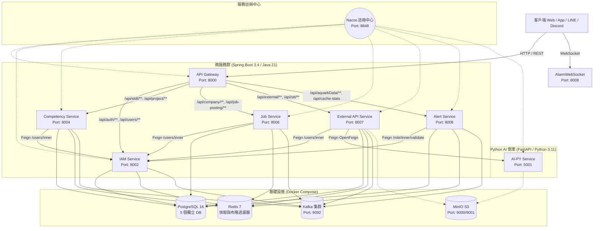

### 微服務清單與職責劃分

| 微服務模組 | 基礎埠號 | 資料庫名稱 | 核心職責與技術要點 |
|---|:---:|:---:|---|
| **`backend-gateway`** | `8000` | - | 系統統一對外入口，負責動態路由轉發、路徑前綴剝除 (`StripPrefix=1`)、內部端點隔離 (`InnerEndpointBlockFilter` 攔截 `/inner/`)、跨域 CORS 與 OpenAPI 規格動態聚合 (`/v3/api-docs-merged`)。 |
| **`backend-iam-service`** | `8002` | `iam_service` | 身分識別與存取管理。提供 JWT 簽發驗證、超級使用者初始化、動態權限字典維護，以及防止自我 Feign 調用的本地權限校驗器 (`LocalPermissionValidatorImpl`)。 |
| **`backend-competency-service`** | `8004` | `competency_service` | 職能與專案管理。涵蓋技能庫、技能等級、專案綁定，以及包含 Transactional Outbox、租約鎖定、Fencing Token 與 SAGA 回滾在內的全套分散式事務補償引擎。 |
| **`backend-job-service`** | `8006` | `job_service` | 企業與職缺媒合服務。提供企業資訊、職缺發布、個人職缺收藏，並整合 Jsoup/Selenium 爬蟲抓取與 AI 職缺結構化分析。 |
| **`backend-external-api-service`** | `8007` | `external_api_service` | 外部整合與 AI 代理中心。提供 LINE/Discord 雙平台機器人（女友對話、語音日記）、MinIO 語音儲存串流端點、Bot 動態配置與 API 用量成本審計。 |
| **`backend-alert-service`** | `8008` | `alert_service` | 即時水情監控與告警服務。提供感測器數據分析、告警閥值比對、Kafka 事件消費、WebSocket 跨節點推播，以及跨服務快取指標統計聚合 (`/cache-stats`)。 |
| **`backend-common`** | - | - | 基礎共用模組。提供 `BaseEntity` 審計實體、Feign Clients 定義、JWT 安全過濾器、三層權限切面 (`PermissionCheck`)、六層快取防穿透管理器與全域例外處理。 |
| **`backend-ai-py`** | `5001` | - | Python FastAPI AI 側車。提供 Faster-Whisper / SenseVoice 語音辨識、GPT-SoVITS / Sherpa-ONNX 語音合成、PyAnnote 語者分離 Conda 子進程隔離與 Ollama SSE 串流推論。 |

---

### 微服務內部通用分層架構 (Layered Architecture)

每個 Java 微服務嚴格遵守高內聚、低耦合的分層架構設計，確保領域邏輯與資料存取完全解耦：

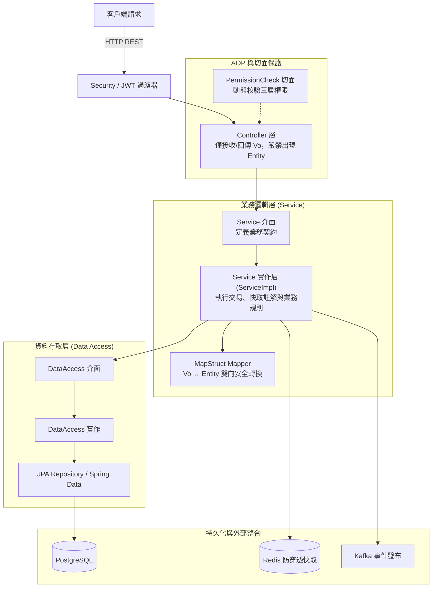

---

# 二、 核心資料模型與 Entity 清冊 (Data Models & JPA Entities)

全專案遵循物件導向與審計規範，所有 JPA 實體均繼承自 `com.example.BackendArchitectureLab.Entity.BaseEntity`，預設具備：
- `id` (UUID 主鍵，自動生成)
- `created_by` / `created_time` (建立者與建立時間)
- `updated_by` / `updated_time` (更新者與更新時間)

### 完整 30 個 JPA Entity 清冊

| 模組名稱 | 實體類別完整路徑 | 對應資料表 | 實體類型 | 業務用途與核心約束 |
|---|---|---|:---:|---|
| **common** | `com.example.BackendArchitectureLab.Entity.BaseEntity` | - | MappedSuperclass | 全系統基礎審計實體 (UUID + 審計欄位)。 |
| **iam-service** | `com.example.BackendArchitectureLab.Entity.User` | `user` | 主實體 | 系統使用者帳號 (`email` 唯一約束)。 |
| | `com.example.BackendArchitectureLab.Entity.Role` | `role` | 主實體 | 角色定義 (`name` 唯一約束)。 |
| | `com.example.BackendArchitectureLab.Entity.Function` | `function` | 主實體 | 階層式功能權限樹 (`parent` 支援樹狀結構)。 |
| | `com.example.BackendArchitectureLab.Entity.UserRole` | `user_role` | 關聯表 | 使用者與角色關聯 (`user_id, role_id` 複合唯一約束)。 |
| | `com.example.BackendArchitectureLab.Entity.RoleFunction` | `role_function` | 關聯表 | 角色與功能權限關聯 (`role_id, function_id` 複合唯一約束)。 |
| **competency-service** | `com.example.BackendArchitectureLab.Entity.Skill` | `skill` | 主實體 | 技能定義字典 (`name` 唯一約束)。 |
| | `com.example.BackendArchitectureLab.Entity.SkillLevel` | `skill_level` | 主實體 | 技能熟練度等級 (`skill_id, level_value` 複合唯一約束)。 |
| | `com.example.BackendArchitectureLab.Entity.Project` | `project` | 主實體 | 專案專案資訊。 |
| | `com.example.BackendArchitectureLab.Entity.UserSkill` | `user_skill` | 關聯表 | 使用者個人技能庫 (`user_id, skill_id` 複合唯一約束)。 |
| | `com.example.BackendArchitectureLab.Entity.ProjectSkill` | `project_skill` | 關聯表 | 專案所需技能清單 (`project_id, skill_id` 複合唯一約束)。 |
| | `com.example.BackendArchitectureLab.Entity.UserProject` | `user_project` | 關聯表 | 專案成員關聯 (`user_id, project_id` 複合唯一約束)。 |
| | `com.example.BackendArchitectureLab.Entity.UserProjectSkill` | `user_project_skill` | 關聯表 | 成員專案技能等級 (`user_id, project_id, skill_id` 複合唯一約束)。 |
| | `com.example.BackendArchitectureLab.Entity.CompensationOutboxEvent` | `compensation_outbox_event` | 事務表 | Transactional Outbox 事件發布佇列與重試狀態。 |
| | `com.example.BackendArchitectureLab.Entity.CompensationEventLog` | `compensation_event_log` | 事務表 | 消費端冪等去重日誌、CAS 狀態機與 Fencing Token。 |
| | `com.example.BackendArchitectureLab.Entity.CompensationRestoreLog` | `compensation_restore_log` | 審計表 | 專案成員技能資料回滾與還原稽核記錄。 |
| | `com.example.BackendArchitectureLab.Entity.ExternalSyncCommand` | `external_sync_command` | 事務表 | 外部系統同步命令持久化、租約控制與防重佇列。 |
| **job-service** | `com.example.BackendArchitectureLab.Entity.Company` | `company` | 主實體 | 企業公司基本資料。 |
| | `com.example.BackendArchitectureLab.Entity.CompanyWebsite` | `company_website` | 子實體 | 企業官方網站與徵才網址列表。 |
| | `com.example.BackendArchitectureLab.Entity.JobPosting` | `job_posting` | 主實體 | 職缺詳細資訊與 AI 結構化分析結果。 |
| | `com.example.BackendArchitectureLab.Entity.UserJobLink` | `user_job_link` | 關聯表 | 使用者職缺收藏與備註 (`user_id, job_posting_id` 複合唯一約束)。 |
| **external-api-service** | `com.example.BackendArchitectureLab.Entity.BotConfig` | `bot_config` | 主實體 | 平台機器人全域參數、每日用量預算與警報閥值。 |
| | `com.example.BackendArchitectureLab.Entity.ApiUsageLog` | `api_usage_log` | 審計表 | 外部 API / LLM 呼叫紀錄與成本估算日誌。 |
| | `com.example.BackendArchitectureLab.Entity.VoiceDiary` | `voice_diary` | 主實體 | 語音日記轉譯文本、語言與音訊來源。 |
| | `com.example.BackendArchitectureLab.Entity.LineGfSession` | `line_gf_session` | 主實體 | LINE 女友對話狀態、Prompt 與歷史上下文 (`user_id` 唯一約束)。 |
| | `com.example.BackendArchitectureLab.Entity.DiscordGfSession` | `discord_gf_session` | 主實體 | Discord 女友對話狀態與頻道設定 (`channel_id, user_id` 唯一)。 |
| | `com.example.BackendArchitectureLab.Entity.DiscordSubscription` | `discord_subscription` | 主實體 | Discord 頻道 Webhook 訂閱與推播設定。 |
| | `com.example.BackendArchitectureLab.Entity.UserVoiceUpload` | `user_voice_upload` | 主實體 | 使用者語音檔案上傳記錄與處理狀態。 |
| | `com.example.BackendArchitectureLab.Entity.VoiceTranslation` | `voice_translation` | 子實體 | 多語系語音轉譯與辨識結果明細。 |
| **alert-service** | `com.example.BackendArchitectureLab.Entity.AquarkData` | `aquark_data` | 主實體 | Aquark 感測器水情歷史時序監測資料。 |
| | `com.example.BackendArchitectureLab.Entity.AlertCheckLimit` | `alert_check_limit` | 主實體 | 水質指標告警上限與監控閥值設定 (`table_name, column_name` 唯一)。 |

---

### 全系統領域 ER 模型圖 (Entity-Relationship Diagrams)

#### 1. IAM 身分與權限領域 ER 模型
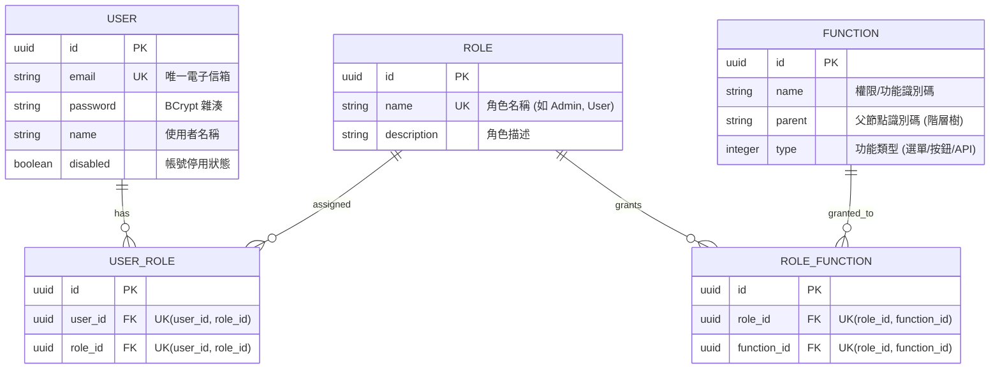

#### 2. Competency 職能、專案與 SAGA 補償事務領域 ER 模型
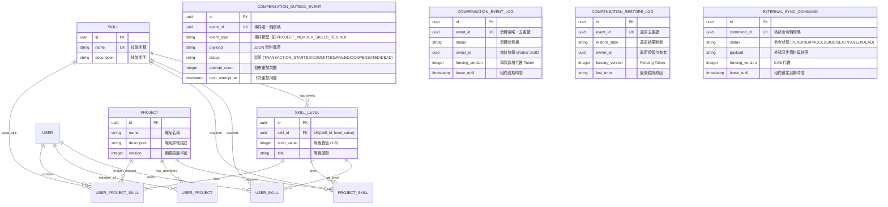

#### 3. Job 企業與職缺媒合領域 ER 模型
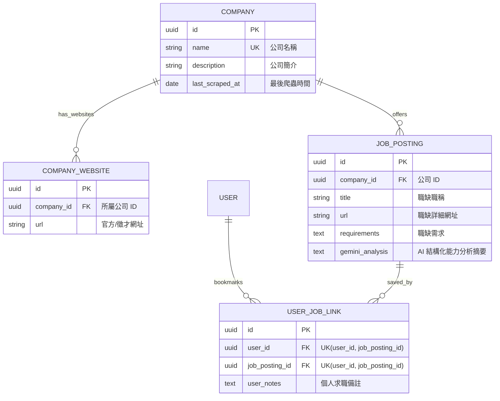

#### 4. External API 與 AI 代理領域 ER 模型
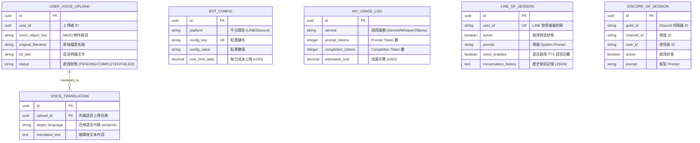

#### 5. Alert 即時水情監控與告警領域 ER 模型
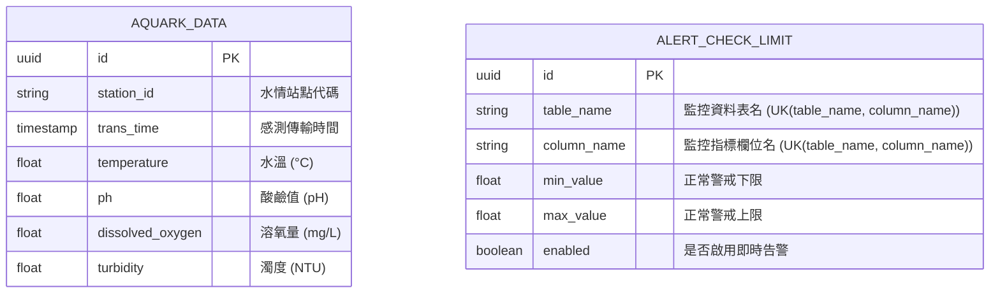

---

# 三、 API 介面清單與 Gateway 路由規則 (API Catalog & Routing)

### 1. 路由規則與隔離機制
* **外部存取規則**：外部客戶端請求統一發送至 Gateway（埠號 `8000`），URL 前綴一律為 `/api/*`。Gateway 透過 `StripPrefix=1` 剝除 `/api` 後轉發至後端微服務。
* **內部端點隔離保護 (`InnerEndpointBlockFilter`)**：
  所有微服務間 RPC 調用端點一律命名為 `/inner/`（如 `/users/inner/*`、`/role/inner/*`、`/ai/inner/*`）。Gateway 在 `@Order(-100)` 攔截外部所有匹配 `.*/inner(/.*)?` 的請求並直接回傳 **HTTP 404 Not Found**，確保內部介面絕不對外暴露。

### 2. 完整 62 個 API 端點清單

#### (1) backend-gateway (埠號: 8000)
| HTTP 方法與子路徑 | 內部直接存取路徑 | Gateway 對外存取路徑 | 端點類型 | 說明 |
|---|---|---|:---:|---|
| `GET /v3/api-docs-merged` | `/v3/api-docs-merged` | `/v3/api-docs-merged` | **Public** | 動態聚合全微服務之 OpenAPI 規格文檔。 |

#### (2) backend-iam-service (埠號: 8002, 路由: `/api/auth/**`, `/api/users/**`, `/api/role/**`, `/api/function/**`)
| Controller 類別名稱 | HTTP 方法與子路徑 | 內部直接路徑 | Gateway 對外路徑 | 端點類型 | 權限需求 / 說明 |
|---|---|---|---|:---:|---|
| `AuthController` | `POST /signup` | `/auth/signup` | `/api/auth/signup` | **Public** | 註冊新使用者 (`@Ignore`)。 |
| | `POST /login` | `/auth/login` | `/api/auth/login` | **Public** | 登入取得 JWT Token (`@Ignore`)。 |
| | `POST /superuser` | `/auth/superuser` | `/api/auth/superuser` | **Public** | 透過 Superuser Key 初始化系統管理者。 |
| `UserController` | `POST /create` | `/users/create` | `/api/users/create` | **Protected** | `Create` 權限。 |
| | `GET /infoVo` | `/users/infoVo` | `/api/users/infoVo` | **Protected** | 取得當前登入使用者詳細資料。 |
| | `GET /{id}` | `/users/{id}` | `/api/users/{id}` | **Protected** | `View` 權限。 |
| | `GET /getAllUser` | `/users/getAllUser` | `/api/users/getAllUser` | **Protected** | `View` 權限。 |
| | `POST /saveUser` | `/users/saveUser` | `/api/users/saveUser` | **Protected** | `Edit` 權限。 |
| | `POST /{userId}/roles/rebind` | `/users/{userId}/roles/rebind` | `/api/users/{userId}/roles/rebind` | **Protected** | `Edit` 權限（重新綁定使用者角色）。 |
| | `POST /search` | `/users/search` | `/api/users/search` | **Protected** | `View` 權限（動態條件分頁搜尋）。 |
| `UserInternalController` | `GET /{id}` | `/users/inner/{id}` | *Gateway 阻擋* | **Internal** | Feign 查詢使用者是否存在與詳情。 |
| | `POST /by-email` | `/users/inner/by-email` | *Gateway 阻擋* | **Internal** | Feign 依 Email 取得使用者。 |
| | `GET /exists/{id}` | `/users/inner/exists/{id}` | *Gateway 阻擋* | **Internal** | Feign 檢查使用者 ID 存在性。 |
| | `GET /by-email-exists` | `/users/inner/by-email-exists` | *Gateway 阻擋* | **Internal** | Feign 檢查 Email 存在性。 |
| `RoleController` | `POST /add` | `/role/add` | `/api/role/add` | **Protected** | `Edit` 權限。 |
| | `POST /addWithFunctions` | `/role/addWithFunctions` | `/api/role/addWithFunctions` | **Protected** | `Edit` 權限。 |
| | `POST /get` | `/role/get` | `/api/role/get` | **Protected** | `View` 權限。 |
| | `POST /update` | `/role/update` | `/api/role/update` | **Protected** | `Edit` 權限。 |
| | `POST /updateWithFunctions` | `/role/updateWithFunctions` | `/api/role/updateWithFunctions` | **Protected** | `Edit` 權限。 |
| | `POST /delete` | `/role/delete` | `/api/role/delete` | **Protected** | `Edit` 權限。 |
| | `POST /roleBindFunction` | `/role/roleBindFunction` | `/api/role/roleBindFunction` | **Protected** | `Edit` 權限。 |
| | `POST /functionBindRole` | `/role/functionBindRole` | `/api/role/functionBindRole` | **Protected** | `Edit` 權限。 |
| | `POST /roleBindUser` | `/role/roleBindUser` | `/api/role/roleBindUser` | **Protected** | `Edit` 權限。 |
| | `POST /userBindRole` | `/role/userBindRole` | `/api/role/userBindRole` | **Protected** | `Edit` 權限。 |
| | `POST /roleUnbindUser` | `/role/roleUnbindUser` | `/api/role/roleUnbindUser` | **Protected** | `Edit` 權限。 |
| | `POST /userUnbindRole` | `/role/userUnbindRole` | `/api/role/userUnbindRole` | **Protected** | `Edit` 權限。 |
| | `POST /roleUnbindFunction` | `/role/roleUnbindFunction` | `/api/role/roleUnbindFunction` | **Protected** | `Edit` 權限。 |
| | `POST /functionUnbindRole` | `/role/functionUnbindRole` | `/api/role/functionUnbindRole` | **Protected** | `Edit` 權限。 |
| | `POST /getFunctionByRole` | `/role/getFunctionByRole` | `/api/role/getFunctionByRole` | **Protected** | `View` 權限。 |
| | `POST /getRoleByFunction` | `/role/getRoleByFunction` | `/api/role/getRoleByFunction` | **Protected** | `View` 權限。 |
| | `POST /getRoleByUser` | `/role/getRoleByUser` | `/api/role/getRoleByUser` | **Protected** | `View` 權限。 |
| | `POST /getUserByRole` | `/role/getUserByRole` | `/api/role/getUserByRole` | **Protected** | `View` 權限。 |
| | `POST /search` | `/role/search` | `/api/role/search` | **Protected** | `View` 權限。 |
| `FunctionController` | `POST /add` | `/function/add` | `/api/function/add` | **Protected** | `Edit` 權限。 |
| | `POST /update` | `/function/update` | `/api/function/update` | **Protected** | `Edit` 權限。 |
| | `POST /delete` | `/function/delete` | `/api/function/delete` | **Protected** | `Edit` 權限。 |
| | `GET /get` | `/function/get` | `/api/function/get` | **Protected** | `View` 權限。 |
| | `POST /saveAllFunction` | `/function/saveAllFunction` | `/api/function/saveAllFunction` | **Protected** | `Edit` 權限。 |
| | `POST /search` | `/function/search` | `/api/function/search` | **Protected** | `View` 權限。 |
| `PermissionInternalController` | `GET /all` | `/role/inner/all` | *Gateway 阻擋* | **Internal** | Feign 獲取全部角色。 |
| | `GET /by-name/{name}` | `/role/inner/by-name/{name}` | *Gateway 阻擋* | **Internal** | Feign 依名稱查詢角色。 |
| | `POST /user-bind-role` | `/role/inner/user-bind-role` | *Gateway 阻擋* | **Internal** | Feign 使用者角色綁定。 |
| | `POST /validate` | `/role/inner/validate` | *Gateway 阻擋* | **Internal** | Feign 動態校驗三層權限。 |

#### (3) backend-competency-service (埠號: 8004, 路由: `/api/skill/**`, `/api/project/**`, `/api/user/bindings/**`)
| Controller 類別名稱 | HTTP 方法與子路徑 | 內部直接路徑 | Gateway 對外路徑 | 端點類型 | 權限需求 / 說明 |
|---|---|---|---|:---:|---|
| `SkillController` | `POST /add` | `/skill/add` | `/api/skill/add` | **Protected** | `Edit` 權限。 |
| | `GET /get` | `/skill/get` | `/api/skill/get` | **Protected** | `View` 權限。 |
| | `POST /update` | `/skill/update` | `/api/skill/update` | **Protected** | `Edit` 權限。 |
| | `POST /delete` | `/skill/delete` | `/api/skill/delete` | **Protected** | `Edit` 權限。 |
| | `POST /search` | `/skill/search` | `/api/skill/search` | **Protected** | `View` 權限。 |
| | `GET /current` | `/skill/current` | `/api/skill/current` | **Protected** | `View` 權限（查詢當前使用者技能）。 |
| | `POST /current/search` | `/skill/current/search` | `/api/skill/current/search` | **Protected** | `View` 權限。 |
| `SkillLevelController` | `POST /add` | `/skill/level/add` | `/api/skill/level/add` | **Protected** | `Edit` 權限。 |
| | `GET /get/{skillId}` | `/skill/level/get/{skillId}` | `/api/skill/level/get/{skillId}` | **Protected** | `View` 權限。 |
| | `POST /update` | `/skill/level/update` | `/api/skill/level/update` | **Protected** | `Edit` 權限。 |
| | `POST /delete` | `/skill/level/delete` | `/api/skill/level/delete` | **Protected** | `Edit` 權限。 |
| | `POST /search` | `/skill/level/search` | `/api/skill/level/search` | **Protected** | `View` 權限。 |
| `PersonalSkillController` | `POST /add` | `/skill/personal/add` | `/api/skill/personal/add` | **Protected** | `Edit` 權限（個人技能新增）。 |
| | `POST /update` | `/skill/personal/update` | `/api/skill/personal/update` | **Protected** | `Edit` 權限。 |
| | `POST /update-level` | `/skill/personal/update-level` | `/api/skill/personal/update-level` | **Protected** | `Edit` 權限。 |
| | `POST /delete` | `/skill/personal/delete` | `/api/skill/personal/delete` | **Protected** | `Edit` 權限。 |
| `ProjectController` | `POST /add` | `/project/add` | `/api/project/add` | **Protected** | `Edit` 權限。 |
| | `GET /get` | `/project/get` | `/api/project/get` | **Protected** | `View` 權限。 |
| | `POST /update` | `/project/update` | `/api/project/update` | **Protected** | `Edit` 權限。 |
| | `POST /delete` | `/project/delete` | `/api/project/delete` | **Protected** | `Edit` 權限。 |
| | `GET /{projectId}/skills` | `/project/{projectId}/skills` | `/api/project/{projectId}/skills` | **Protected** | `View` 權限。 |
| | `POST /search` | `/project/search` | `/api/project/search` | **Protected** | `View` 權限。 |
| | `GET /current` | `/project/current` | `/api/project/current` | **Protected** | `View` 權限（查詢當前使用者專案）。 |
| | `POST /current/search` | `/project/current/search` | `/api/project/current/search` | **Protected** | `View` 權限。 |
| `PersonalProjectController` | `POST /add` | `/project/personal/add` | `/api/project/personal/add` | **Protected** | `Edit` 權限（個人專案管理）。 |
| | `PUT /update/{projectId}` | `/project/personal/update/{projectId}` | `/api/project/personal/update/{projectId}` | **Protected** | `Edit` 權限。 |
| | `DELETE /delete/{projectId}` | `/project/personal/delete/{projectId}` | `/api/project/personal/delete/{projectId}` | **Protected** | `Edit` 權限。 |
| | `GET /{projectId}/skills` | `/project/personal/{projectId}/skills` | `/api/project/personal/{projectId}/skills` | **Protected** | `View` 權限。 |
| | `POST /{projectId}/skill/bind` | `/project/personal/{projectId}/skill/bind` | `/api/project/personal/{projectId}/skill/bind` | **Protected** | `Edit` 權限。 |
| | `PUT /{projectId}/skill/{skillId}/level` | `/project/personal/{projectId}/skill/{skillId}/level` | `/api/project/personal/{projectId}/skill/{skillId}/level` | **Protected** | `Edit` 權限。 |
| | `DELETE /{projectId}/skill/{skillId}` | `/project/personal/{projectId}/skill/{skillId}` | `/api/project/personal/{projectId}/skill/{skillId}` | **Protected** | `Edit` 權限。 |
| `ProjectManagementController` | `POST /bindSkill` | `/project/bindSkill` | `/api/project/bindSkill` | **Protected** | `Edit` 權限。 |
| | `GET /{projectId}/member-skills` | `/project/{projectId}/member-skills` | `/api/project/{projectId}/member-skills` | **Protected** | `View` 權限。 |
| `ProjectAdminController` | `POST /user-project/rebind` | `/project/admin/bindings/user-project/rebind` | `/api/project/admin/bindings/user-project/rebind` | **Protected** | `Edit` 權限（覆蓋式綁定）。 |
| | `POST /user-skill/rebind` | `/project/admin/bindings/user-skill/rebind` | `/api/project/admin/bindings/user-skill/rebind` | **Protected** | `Edit` 權限。 |
| | `POST /project-skill/rebind` | `/project/admin/bindings/project-skill/rebind` | `/api/project/admin/bindings/project-skill/rebind` | **Protected** | `Edit` 權限。 |
| | `POST /project-members-skills/rebind` | `/project/admin/bindings/project-members-skills/rebind` | `/api/project/admin/bindings/project-members-skills/rebind` | **Protected** | `Edit` 權限（觸發 SAGA 外部同步與 Outbox 事務補償）。 |
| `UserBindingController` | `POST /skill/rebind` | `/user/bindings/skill/rebind` | `/api/user/bindings/skill/rebind` | **Protected** | `Edit` 權限。 |
| | `POST /project/{projectId}/skill/rebind` | `/user/bindings/project/{projectId}/skill/rebind` | `/api/user/bindings/project/{projectId}/skill/rebind` | **Protected** | `Edit` 權限。 |

#### (4) backend-job-service (埠號: 8006, 路由: `/api/company/**`, `/api/job-posting/**`, `/api/user-job-link/**`, `/api/user/bindings/job/**`)
| Controller 類別名稱 | HTTP 方法與子路徑 | 內部直接路徑 | Gateway 對外路徑 | 端點類型 | 權限需求 / 說明 |
|---|---|---|---|:---:|---|
| `CompanyController` | `POST /add` | `/company/add` | `/api/company/add` | **Protected** | `Edit` 權限。 |
| | `GET /get` | `/company/get` | `/api/company/get` | **Protected** | `View` 權限。 |
| | `GET /get/{id}` | `/company/get/{id}` | `/api/company/get/{id}` | **Protected** | `View` 權限。 |
| | `PUT /update` | `/company/update` | `/api/company/update` | **Protected** | `Edit` 權限。 |
| | `POST /search` | `/company/search` | `/api/company/search` | **Protected** | `View` 權限。 |
| | `DELETE /delete/{id}` | `/company/delete/{id}` | `/api/company/delete/{id}` | **Protected** | `Edit` 權限。 |
| `JobPostingController` | `POST /add` | `/job-posting/add` | `/api/job-posting/add` | **Protected** | `Edit` 權限。 |
| | `GET /get` | `/job-posting/get` | `/api/job-posting/get` | **Protected** | `View` 權限。 |
| | `GET /get/{id}` | `/job-posting/get/{id}` | `/api/job-posting/get/{id}` | **Protected** | `View` 權限。 |
| | `GET /company/{companyId}` | `/job-posting/company/{companyId}` | `/api/job-posting/company/{companyId}` | **Protected** | `View` 權限。 |
| | `PUT /update` | `/job-posting/update` | `/api/job-posting/update` | **Protected** | `Edit` 權限。 |
| | `DELETE /delete/{id}` | `/job-posting/delete/{id}` | `/api/job-posting/delete/{id}` | **Protected** | `Edit` 權限。 |
| | `POST /scrape/{companyId}` | `/job-posting/scrape/{companyId}` | `/api/job-posting/scrape/{companyId}` | **Protected** | `Scrape` 權限（啟動爬蟲與 AI 分析）。 |
| | `POST /search` | `/job-posting/search` | `/api/job-posting/search` | **Protected** | `View` 權限。 |
| `UserJobLinkController` | `POST /add` | `/user-job-link/add` | `/api/user-job-link/add` | **Protected** | `Edit` 權限。 |
| | `PUT /update` | `/user-job-link/update` | `/api/user-job-link/update` | **Protected** | `Edit` 權限。 |
| | `GET /get` | `/user-job-link/get` | `/api/user-job-link/get` | **Protected** | `View` 權限。 |
| | `GET /get/{id}` | `/user-job-link/get/{id}` | `/api/user-job-link/get/{id}` | **Protected** | `View` 權限。 |
| | `GET /user/{userId}` | `/user-job-link/user/{userId}` | `/api/user-job-link/user/{userId}` | **Protected** | `View` 權限。 |
| | `GET /job-posting/{jobPostingId}` | `/user-job-link/job-posting/{jobPostingId}` | `/api/user-job-link/job-posting/{jobPostingId}` | **Protected** | `View` 權限。 |
| | `DELETE /delete/{id}` | `/user-job-link/delete/{id}` | `/api/user-job-link/delete/{id}` | **Protected** | `Edit` 權限。 |
| `UserJobBindingController` | `POST /add/{jobPostingId}` | `/user/bindings/job/add/{jobPostingId}` | `/api/user/bindings/job/add/{jobPostingId}` | **Protected** | 當前登入使用者收藏職缺。 |
| | `DELETE /{jobPostingId}` | `/user/bindings/job/{jobPostingId}` | `/api/user/bindings/job/{jobPostingId}` | **Protected** | 當前登入使用者取消收藏。 |
| | `GET ` | `/user/bindings/job` | `/api/user/bindings/job` | **Protected** | 查詢當前登入使用者收藏職缺清單。 |

#### (5) backend-external-api-service (埠號: 8007, 路由: `/api/stt/**`, `/api/ai/**`, `/api/external/**`, `/api/voice-uploads/**`)
| Controller 類別名稱 | HTTP 方法與子路徑 | 內部直接路徑 | Gateway 對外路徑 | 端點類型 | 權限需求 / 說明 |
|---|---|---|---|:---:|---|
| `DiaryController` | `GET ` | `/external/diary` | `/api/external/diary` | **Protected** | 查詢當前使用者語音日記。 |
| `ConfigController` | `GET ` | `/external/config` | `/api/external/config` | **Protected** | `View` 權限（機器人全域設定）。 |
| | `GET /{id}` | `/external/config/{id}` | `/api/external/config/{id}` | **Protected** | `View` 權限。 |
| | `POST ` | `/external/config` | `/api/external/config` | **Protected** | `Edit` 權限。 |
| | `PUT /{id}` | `/external/config/{id}` | `/api/external/config/{id}` | **Protected** | `Edit` 權限。 |
| | `DELETE /{id}` | `/external/config/{id}` | `/api/external/config/{id}` | **Protected** | `Edit` 權限。 |
| `VoiceUploadController` | `POST ` | `/api/voice-uploads` | `/api/voice-uploads` | **Protected** | 上傳使用者語音檔案。 |
| | `GET /{id}` | `/api/voice-uploads/{id}` | `/api/voice-uploads/{id}` | **Protected** | 取得特定語音上傳狀態與明細。 |
| | `POST /current/search` | `/api/voice-uploads/current/search` | `/api/voice-uploads/current/search` | **Protected** | 搜尋當前使用者之語音上傳紀錄。 |
| | `POST /{id}/translations` | `/api/voice-uploads/{id}/translations` | `/api/voice-uploads/{id}/translations` | **Protected** | 執行/新增語音轉譯任務。 |
| | `GET /{id}/translations` | `/api/voice-uploads/{id}/translations` | `/api/voice-uploads/{id}/translations` | **Protected** | 取得轉譯多語系結果。 |
| `UsageController` | `GET ` | `/external/usage` | `/api/external/usage` | **Protected** | 查詢 API 呼叫用量記錄。 |
| | `GET /summary` | `/external/usage/summary` | `/api/external/usage/summary` | **Protected** | 取得 API 用量與成本統計摘要。 |
| `TtsRefAudioController` | `POST /external/tts/ref-audio` | `/external/tts/ref-audio` | `/api/external/tts/ref-audio` | **Public** | 上傳 GPT-SoVITS 參考音訊 (`@Ignore`)。 |
| `SttController` | `POST /whisper` | `/stt/whisper` | `/api/stt/whisper` | **Protected** | 指定 Faster-Whisper 轉錄。 |
| | `POST /sensevoice` | `/stt/sensevoice` | `/api/stt/sensevoice` | **Protected** | 指定 SenseVoice 轉錄。 |
| `LineWebhookController` | `POST /external/line/callback` | `/external/line/callback` | `/api/external/line/callback` | **Public** | LINE 女友機器人 Webhook 回呼 (`@Ignore`)。 |
| | `POST /external/line/diary/callback` | `/external/line/diary/callback` | `/api/external/line/diary/callback` | **Public** | LINE 語音日記 Webhook 回呼 (`@Ignore`)。 |
| | `GET /external/public/audio/stream/{fileName}` | `/external/public/audio/stream/{fileName}` | `/api/external/public/audio/stream/{fileName}` | **Public** | LINE 音訊公開串流播放端點 (`@Ignore`)。 |
| `LearnController` | `POST /{lan}/{mode}` | `/stt/v1/{lan}/{mode}` | `/api/stt/v1/{lan}/{mode}` | **Protected** | 語音轉文字 + 本地 NLP 拼音注音轉換。 |
| `AiInternalController` | `POST /analyze-jobs` | `/ai/inner/analyze-jobs` | *Gateway 阻擋* | **Internal** | Feign 多模型瀑布分析職缺資料。 |

#### (6) backend-alert-service (埠號: 8008, 路由: `/api/alertCheckLimit/**`, `/api/aquarkData/**`, `/api/cache-stats`)
| Controller 類別名稱 | HTTP 方法與子路徑 | 內部直接路徑 | Gateway 對外路徑 | 端點類型 | 權限需求 / 說明 |
|---|---|---|---|:---:|---|
| `AlertCheckLimitController` | `POST /add` | `/alertCheckLimit/add` | `/api/alertCheckLimit/add` | **Protected** | `Edit` 權限。 |
| | `GET /get` | `/alertCheckLimit/get` | `/api/alertCheckLimit/get` | **Protected** | `View` 權限。 |
| | `POST /update` | `/alertCheckLimit/update` | `/api/alertCheckLimit/update` | **Protected** | `Edit` 權限。 |
| | `POST /delete` | `/alertCheckLimit/delete` | `/api/alertCheckLimit/delete` | **Protected** | `Edit` 權限。 |
| | `POST /search` | `/alertCheckLimit/search` | `/api/alertCheckLimit/search` | **Protected** | `View` 權限。 |
| `AquarkDataController` | `POST /getData` | `/aquarkData/getData` | `/api/aquarkData/getData` | **Protected** | `View` 權限（查詢感測器時序資料）。 |
| | `GET /getColumnNameList` | `/aquarkData/getColumnNameList` | `/api/aquarkData/getColumnNameList` | **Protected** | `View` 權限。 |
| | `POST /getAverage` | `/aquarkData/getAverage` | `/api/aquarkData/getAverage` | **Public** | 計算數值平均值 (`@Ignore`)。 |
| `CacheStatsController` | `GET ` | `/cache-stats` | `/api/cache-stats` | **Protected** | 查詢全微服務聚合之快取指標與命中率。 |

#### (7) backend-ai-py (FastAPI 側車, 埠號: 5001, 僅供 Java 微服務內部調用)
| 模組 / Router | HTTP 方法與子路徑 | 內部直接路徑 | 對外狀態 | 說明 |
|---|---|---|:---:|---|
| `main.py` | `GET /health` | `/health` | **Public** | 側車健康檢查端點。 |
| `routers/stt.py` | `POST /stt` | `/stt` | **Internal** | 預設 STT 轉錄端點（接收 MinIO Object Key）。 |
| | `POST /stt/whisper` | `/stt/whisper` | **Internal** | 指定 Faster-Whisper 推論。 |
| | `POST /stt/sensevoice` | `/stt/sensevoice` | **Internal** | 指定 SenseVoice 離線純 CPU 推論。 |
| `routers/tts.py` | `POST /tts` | `/tts` | **Internal** | 語音合成（GPT-SoVITS 音色克隆 / Sherpa 備援）。 |
| `routers/chat.py` | `POST /chat` | `/chat` | **Internal** | Ollama LLM 對話推論（支援 SSE 串流）。 |

---

# 四、 安全、AOP 與權限設計 (Security, AOP & Authentication)

### 1. JWT 認證與動態三層 RBAC 授權資料流

全系統採用宣告式註解 `@RequirePermission` 進行精細化權限控制。切面 `com.example.BackendArchitectureLab.Aop.PermissionCheck` 會在執行 Controller 前動態解析三層權限：

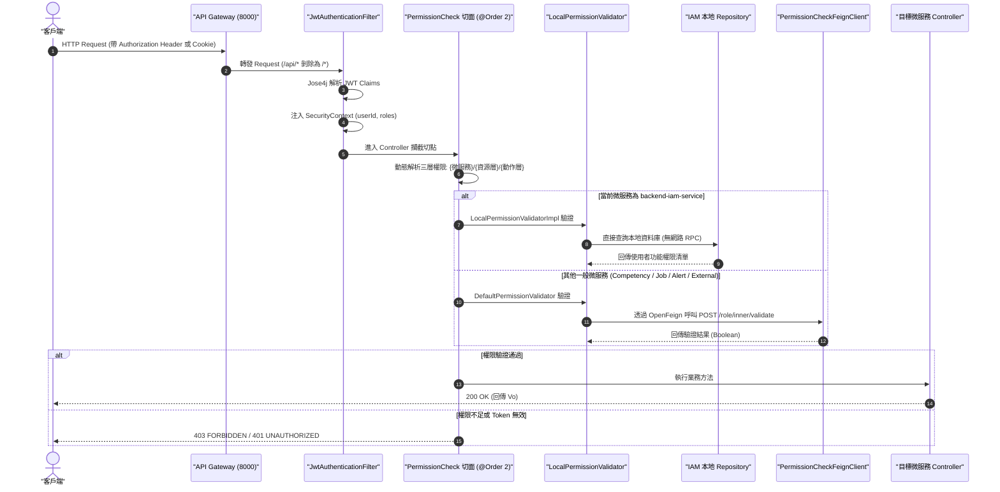

### 2. IAM 服務防死鎖本地校驗優化
- **一般微服務**：透過 `DefaultPermissionValidator` 呼叫 Feign Client `PermissionCheckFeignClient` 向 IAM 發送驗證請求。
- **IAM 服務本身**：透過 `com.example.BackendArchitectureLab.Service.Impl.LocalPermissionValidatorImpl` 覆寫抽象類別，直接查詢本地資料庫，**徹底杜絕 IAM 服務在權限校驗時發起自我 Feign 呼叫而導致的連線池死鎖與線程耗盡**。

### 3. JWT 雙來源解析與 Feign 憑證透明轉發
- **雙來源解析**：`JwtAuthenticationFilter` 同步支援 HTTP Header `Authorization: Bearer <token>` 與 Cookie `v3-admin-vite-token-key=<token>`。
- **Feign 鏈路轉發**：`com.example.BackendArchitectureLab.Config.FeignConfig.bearerTokenInterceptor` 於微服務間調用時自動從 `RequestContextHolder` 提取原 Header 轉發，確保跨服務調用之使用者身分不遺失。

---

# 五、 分散式事務補償與外部同步架構 (SAGA & Outbox)

在 `backend-competency-service` 中，專案實作了企業級 **Durable Command + Transactional Outbox + Lease/Fencing Token + SAGA 補償機制**：

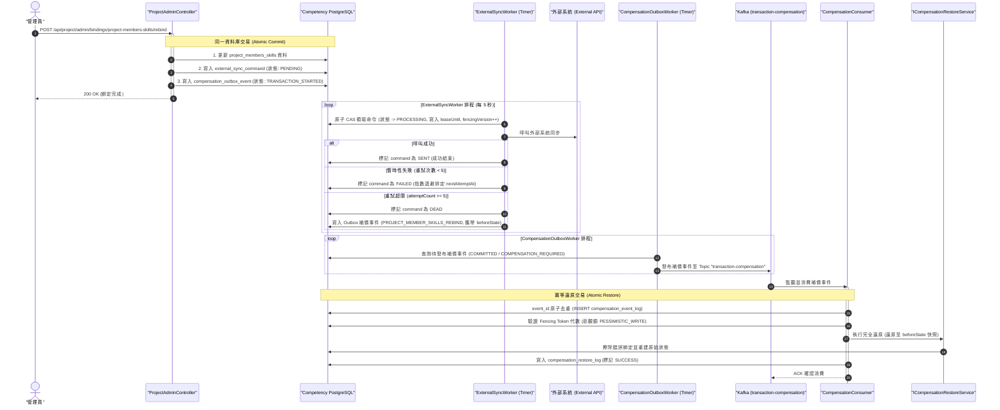

### Kafka Topics 與事件流一覽

| Topic 名稱 | 發布者 (Publisher) | 消費者 (Consumer) | 說明與用途 |
|---|---|---|---|
| **`socketSend`** | `AlarmKafkaPublisher` (`alert-service`) | `KafkaConsumerService` (`alert-service`, group: `myGroup`) | 即時水情告警推播至前端 WebSocket。 |
| **`cache-stats`** | `KafkaCacheStatsPublisher` (`backend-common`) | `CacheStatsConsumer` (`alert-service`, group: `myGroup`) | 快取命中率、Miss 與布隆過濾器阻擋統計聚合至 Redis Hash (`cache:stats:*`)。 |
| **`transaction-compensation`** | `CompensationPublisherImpl` (`competency-service`) | `CompensationConsumer` (`competency-service`, group: `compensation-group`) | 分散式事務補償事件消費與資料回滾。 |
| **`transaction-compensation.DLT`** | `KafkaCompensationConfig` 死信發布器 | 人工運維介入 | 永久不可重試（如版本不相容）或重試耗盡之死信佇列。 |

---

# 六、 高併發快取防穿透架構 (High-Concurrency Caching)

本專案實作了嚴格的 **六層快取防禦機制 (`CachePenetrationProtectionCache`)**，並由 `BloomFilterInitializer` 於系統啟動時動態預熱資料庫主鍵至 Redisson `RBloomFilter`：

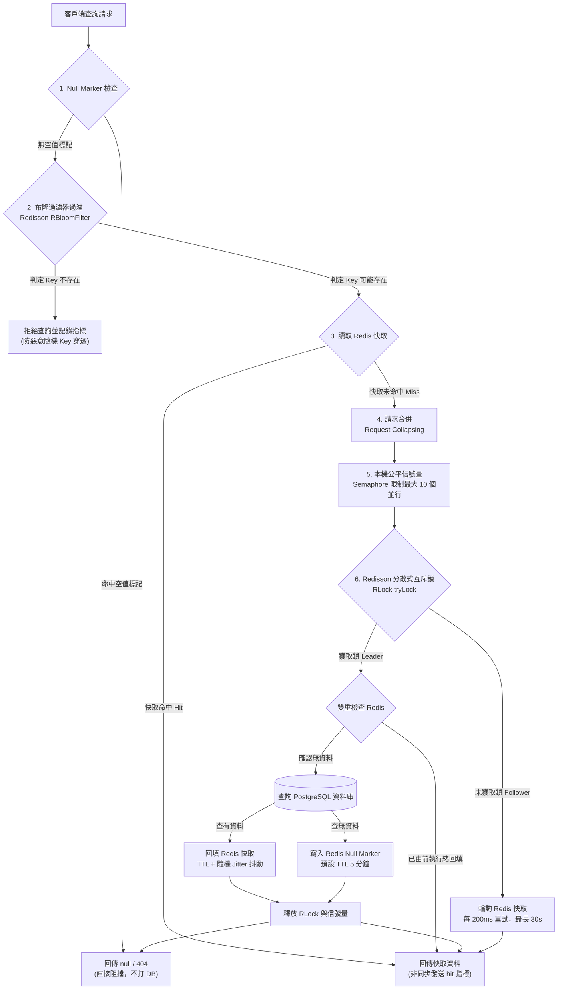

### 19 個 Cache Names 與 TTL / Jitter 配置表

系統在 `com.example.BackendArchitectureLab.Config.RedisConfig` 中為各業務資料精細化配置了快取存活時間（TTL）與隨機 Jitter 抖動（預設最大 30%），徹底杜絕快取雪崩：

| Cache Name | 配置 TTL | 抖動防護 (Jitter) | 作用領域與業務對象 |
|---|:---:|:---:|---|
| `users` | 2 小時 | + 隨機 Jitter | 使用者基本資料、Email 與動態條件搜尋快取。 |
| `alertCheckLimit` | 1 小時 | + 隨機 Jitter | 水情告警閥值設定快取。 |
| `aquarkData` | 1 小時 | + 隨機 Jitter | 感測器水情歷史時序資料快取。 |
| `skills` | 24 小時 | + 隨機 Jitter | 技能定義與技能列表快取。 |
| `skillLevels` | 24 小時 | + 隨機 Jitter | 技能等級列表快取。 |
| `roles` | 6 小時 | + 隨機 Jitter | 角色定義與角色清單快取。 |
| `roleFunctions` | 6 小時 | + 隨機 Jitter | 角色對應之功能權限列表快取。 |
| `functions` | 24 小時 | + 隨機 Jitter | 系統功能權限清單快取。 |
| `companies` | 6 小時 | + 隨機 Jitter | 企業公司資訊快取。 |
| `jobPostings` | 1 小時 | + 隨機 Jitter | 職缺清單與搜尋結果快取。 |
| `projectSkills` | 30 分鐘 | + 隨機 Jitter | 專案所需技能關聯快取。 |
| `projectMemberSkills` | 30 分鐘 | + 隨機 Jitter | 專案成員技能關聯快取。 |
| `projects` | 10 分鐘 | + 隨機 Jitter | 專案基本資料與個人專案清單快取。 |
| `currentUserSkills` | 10 分鐘 | + 隨機 Jitter | 當前登入使用者技能清單快取。 |
| `userJobLinks` | 10 分鐘 | + 隨機 Jitter | 使用者收藏職缺清單快取。 |
| `userRoles` | 10 分鐘 | + 隨機 Jitter | 使用者角色綁定關聯快取。 |
| `aquarkDataAvg` | 30 分鐘 | + 隨機 Jitter | 水質指標平均值運算快取。 |
| `userVoiceUploads` | 10 分鐘 | + 隨機 Jitter | 使用者語音上傳任務與狀態快取。 |
| `voiceTranslations` | 10 分鐘 | + 隨機 Jitter | 語音轉譯多語系結果快取。 |

---

### 分散式快取指標非同步統計資料流

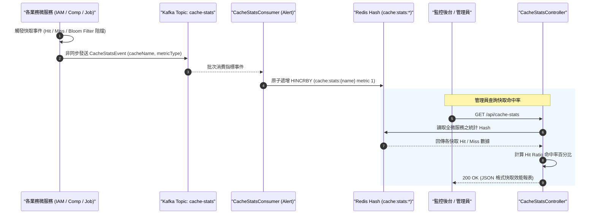

---

# 七、 AI 語音與大腦推論架構 (AI Sidecar & Bot Pipelines)

### 1. Python AI 側車隔離與語音處理管線

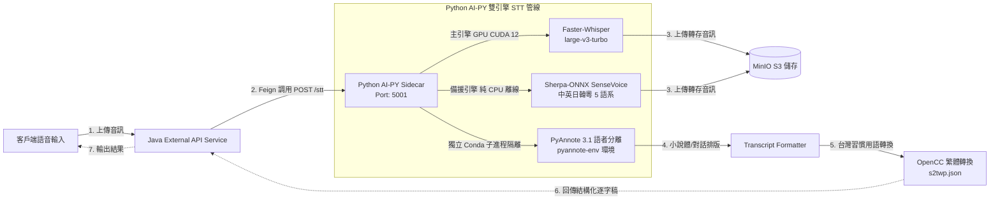

---

### 2. LINE & Discord 機器人對話大腦與語音合成閉環

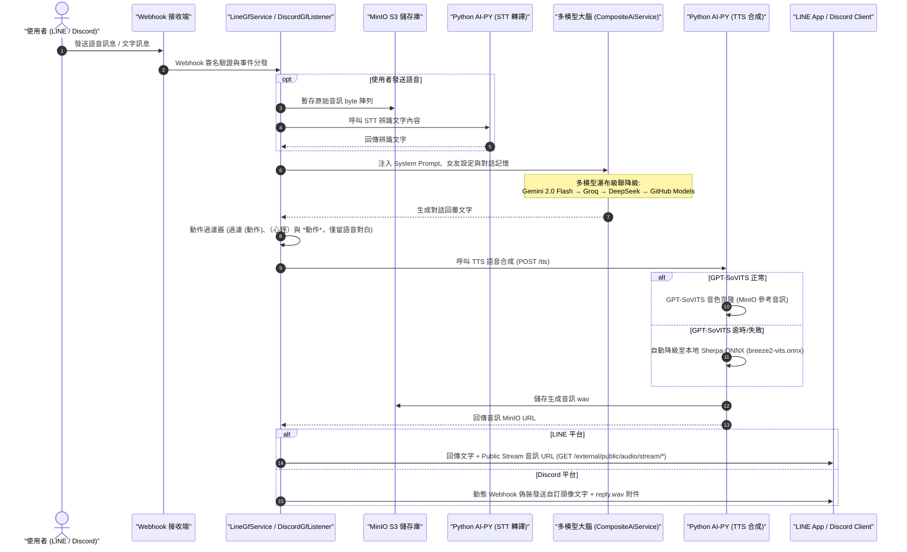

---

# 八、 WebSocket 即時告警架構 (Alert WebSocket)

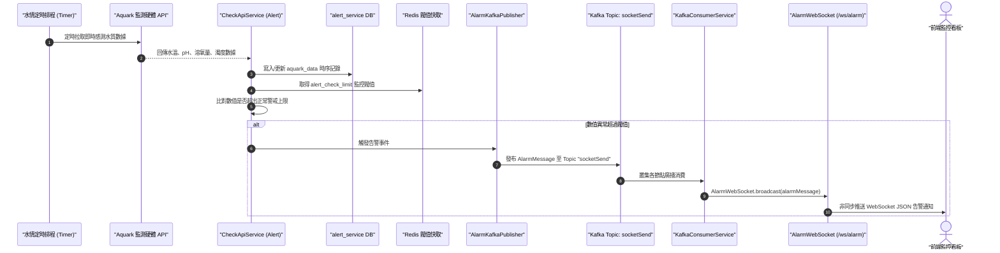

---

# 九、 品質保證 (Quality)、CI/CD 與 500 併發壓力測試

### 1. GitHub Actions CI 雙軌驗證
- **Java CI**：JDK 21 + `./mvnw test jacoco:check`，強制要求 **BUNDLE 覆蓋率 $\ge 80\%$**。
- **Python CI**：Python 3.11 + `ruff check` + `ruff format --check` + `pytest backend-ai-py`（28+ 測試）。
- **AI Code Review**：獨立之 `ai-review-trigger.yml` 與 `ai-review-trusted.yml` 提供自動化 PR 程式碼審查。
- **映像檔建置**：Docker Buildx 多架構建置與 Docker Hub 自動推送。

### 2. JMeter 500 併發壓力測試套件 (`stress-test/`)
- **資料庫一鍵初始化**：`init-dbs.sql` 一鍵建立 5 大獨立資料庫。
- **10 個 SQL 大量測試數據生成腳本**：包含 50,003 筆使用者、50,000 個專案、200,000 筆水質時序數據（具備 `ON CONFLICT` 冪等防重特性）。
- **4 大壓測場景 (`.jmx`)**：
  - `test-iam.jmx`：500 併發，高頻讀取（Login / Users Search / Role / Function）。
  - `test-competency.jmx`：500 併發，80% 讀取 + 20% 寫入（Skill Search / Project Search / Personal Skill Add）。
  - `test-job.jmx`：500 併發，80% 讀取 + 20% 寫入（Company Search / Job Search / Company Add）。
  - `test-alert.jmx`：200 併發，水情時序數據查詢。
- **自動化執行腳本**：`run-with-cache.ps1` 與 `run-without-cache.ps1`，自動統計 P50/P90/P95/P99 延遲並產出報告。

### 3. 程式碼規範 (Architecture Conventions)
- **建構子注入**：全面採用 Lombok `@RequiredArgsConstructor` + `private final`，生產程式碼嚴禁 `@Autowired` 欄位注入。
- **嚴格分層**：Mapper 僅限於 Service Impl 層使用；Service 介面一律回傳 Vo；Controller 嚴禁出現 JPA Entity。
- **禁止長路徑完全限定名稱 (FQN)**：原始碼檔案一律在頂部顯式 `import`，程式碼內部僅使用簡潔類別名稱 (Simple Name)。

---

# 十、 重要設定與環境變數對照表 (.env.example)

根目錄 `.env.example` 涵蓋全系統所需之關鍵環境變數：

| 變數類別 | 環境變數名稱 | 預設 / 範例值 | 影響與配置用途 |
|---|---|---|---|
| **基礎網路** | `SERVER_PORT` | `8000` | Gateway 服務監聽埠號。 |
| | `APP_IN_DOCKER` | `false` | 若後端運行於 Docker 容器設為 `true`（Redis/Kafka 自動解析為容器名稱）。 |
| **PostgreSQL** | `POSTGRES_PORT` | `5432` | 資料庫對外埠號。 |
| | `POSTGRES_USER` / `PASSWORD` | `postgres` / `your_postgres_password` | 資料庫登入認證（Compose 預設回退 `verYs3cret`）。 |
| **Redis** | `REDIS_PORT` | `6379` | Redis 埠號。 |
| | `REDIS_PASSWORD` | `your_redis_password` | Redis 連線密碼。 |
| | `REDIS_CACHE_TTL_HOURS` | `1` | 快取預設存活時間（小時）。 |
| **Kafka** | `KAFKA_PORT` | `9092` | Kafka Broker 埠號。 |
| | `KAFKA_ADVERTISED_HOST` | `localhost` | Kafka Advertised Listener Host。 |
| **MinIO** | `MINIO_API_PORT` / `CONSOLE_PORT` | `9000` / `9001` | S3 API 與 Web 控制台埠號。 |
| | `MINIO_URL` | `http://localhost:9000` | 後端連線 MinIO 端點。 |
| | `MINIO_ACCESS_KEY` / `SECRET_KEY` | `minioadmin` / `your_minio_password` | MinIO 存取密鑰。 |
| **JWT 安全** | `JWT_SECRET_USE` | `change_to_your_jwt_secret` | JWT 簽名金鑰（至少 256 bits）。 |
| | `JWT_EXPIRATION_MINUTES` | `1440` | JWT 有效期限（24 小時）。 |
| **外部 AI 金鑰** | `GEMINI_API_KEY` | `""` | Google Gemini API 金鑰（預設模型 `gemini-3.7-flash`）。 |
| | `DEEPSEEK_API_KEY` | `""` | DeepSeek API 金鑰 (`deepseek-v4-flash`)。 |
| | `GROQ_API_KEY` | `""` | Groq API 金鑰 (`llama-3.3-70b-versatile`)。 |
| | `GITHUB_MODELS_API_KEY` | `""` | GitHub Models API 金鑰 (`gpt-4o-mini`)。 |
| **社群 Bot** | `LINE_CHANNEL_SECRET` / `TOKEN` | `""` | LINE 通用 Channel Secret 與 Token。 |
| | `DISCORD_GF_TOKEN` / `DIARY_TOKEN`| `""` | Discord 女友與語音日記 Bot Token。 |
| **Python Sidecar** | `AI_PY_PORT` | `5001` | Python FastAPI 側車監聽埠號。 |
| | `WHISPER_MODEL_SIZE` | `large-v3-turbo` | Faster-Whisper 模型規格。 |
| | `WHISPER_DEVICE` | `cuda` (無 GPU 可設 `cpu`) | Whisper 推論裝置。 |
| | `GPT_SOVIT_URL` | `http://127.0.0.1:9880/tts` | GPT-SoVITS 語音合成端點。 |
| | `OLLAMA_BASE_URL` | `http://localhost:11434` | Ollama LLM 服務端點（模型 `gemma4:31b-cloud`）。 |
| **壓力測試** | `JMETER_BIN` | `C:\path\to\jmeter\bin\jmeter.bat` | Apache JMeter 執行檔路徑。 |

---

# 十一、 快速啟動指南 (Quick Start)

### 步驟 0：環境變數設定
```bash
cp .env.example .env
# 編輯 .env 填入各項 API Key 與資料庫密碼
```

### 步驟 1：啟動 Docker 基礎設施
```bash
docker compose -f compose.yaml up -d
```
> 初始化會自動執行 `init-dbs.sql`，建立 5 個微服務獨立資料庫。

### 步驟 2：啟動 Python AI 側車服務
```bash
conda env create -f backend-ai-py/environment.yml  # 首次建立環境
conda run -n backend-ai-py uvicorn main:app --port 5001
```

### 步驟 3：啟動 Java 後端微服務
依序在獨立終端機啟動微服務（IAM 優先啟動以建立權限字典，Gateway 最後啟動）：
```bash
./mvnw spring-boot:run -pl backend-iam-service
./mvnw spring-boot:run -pl backend-competency-service
./mvnw spring-boot:run -pl backend-job-service
./mvnw spring-boot:run -pl backend-external-api-service
./mvnw spring-boot:run -pl backend-alert-service
./mvnw spring-boot:run -pl backend-gateway
```

### 步驟 4：存取 OpenAPI / Swagger UI
開啟瀏覽器訪問 Gateway 聚合文檔：
- **Swagger UI**：`http://localhost:8000/swagger-ui/index.html`
- **OpenAPI 聚合 JSON**：`http://localhost:8000/v3/api-docs-merged`

---

# 十二、 常見問題排除 (Troubleshooting)

### 1. Kafka 連線失敗 (`Connection could not be established`)
- **本機執行**：確認 `.env` 設定 `KAFKA_ADVERTISED_HOST=localhost`。
- **Docker 容器內執行**：設定 `APP_IN_DOCKER=true`，系統將自動切換為 `kafka:9092`。

### 2. Redis 連線逾時或認證失敗
- 檢查 `compose.yaml` 與 `application.yml` 的密碼配置是否一致。
- 透過容器命令驗證連線：`docker exec -it redis_container redis-cli ping`（預期回傳 `PONG`）。

### 3. PostgreSQL 資料庫不存在 (`database "xxx" does not exist`)
- 若非透過 Docker Compose 首次啟動，請手動執行 `init-dbs.sql` 建立 5 個獨立 Database：
  ```bash
  docker exec -i postgres_db_backend psql -U postgres < init-dbs.sql
  ```

### 4. WebSocket 連線失敗 (`ws://localhost:8000/ws/alarm`)
- 若透過反向代理，請確保 Nginx 配置了 `Upgrade` 與 `Connection "upgrade"` 標頭。
- 確認 `backend-alert-service` 正常運作且 Kafka Broker 可達。

---

# 十三、 開發藍圖與驗證狀態 (Roadmap & Status)

### Infrastructure & Operations
- [x] Prometheus Metrics (`/actuator/prometheus` 全微服務標準整合)
- [x] Grafana 儀表板整合支援
- [x] Docker Compose 一鍵啟動環境
- [ ] Centralized Logging (ELK / Loki Stack)

### Architecture & Distributed Patterns
- [x] Transactional Outbox Pattern (`compensation_outbox_event`)
- [x] Redisson Distributed Mutex Lock (六層快取防穿透)
- [x] Lease-based Fencing Token 租約控制與 CAS 狀態機
- [x] SAGA 分散式事務補償與自動還原閉環
- [x] Event-Driven Architecture (Kafka 4 大主題)

### Quality & Benchmark
- [x] Unit Test + JaCoCo Coverage Check (BUNDLE $\ge 80\%$)
- [x] JMeter 500 併發壓力測試套件與 SQL 數據生成器 (`stress-test/`)
- [x] GitHub Actions 雙軌 CI + AI Code Review
- [ ] Testcontainers 端到端整合測試

### AI Integration
- [x] Faster-Whisper / SenseVoice 雙引擎語音辨識 (STT)
- [x] GPT-SoVITS / Sherpa-ONNX 雙引擎語音合成 (TTS)
- [x] PyAnnote 語者分離 Conda 獨立子進程隔離
- [x] 多模型瀑布級聯降級 (Gemini 2.0 Flash → Groq → DeepSeek → GitHub Models)
- [x] LINE / Discord 雙平台智慧助理與語音串流
- [ ] Milvus 向量檢索與 RAG 知識庫整合
