# Backend Architecture Validation Platform

> Personal Backend Architecture Validation Platform

本專案並非教學範例，而是作為後端架構設計、技術驗證與工程實踐的平台，持續驗證企業級系統常見設計模式、系統架構與開發流程。

專案以 Java 21 與 Spring Boot 3 為核心，整合 Authentication、Authorization、Cache、Event-Driven Architecture、Real-Time Notification、AI Integration 與 CI/CD Automation 等常見企業級技術。

透過實際開發驗證大型系統常見技術選型、架構設計與工程實務，並持續擴充作為個人技術研究平台。

---

## Architecture Highlights

- Spring Security + JWT Authentication
- Annotation-based RBAC Authorization
- Redis Multi-Level Cache Strategy
- Kafka Event-Driven Architecture
- Kafka-based Cache Stats Monitoring
- WebSocket Real-Time Notification
- JPA Specification Dynamic Query
- Docker Compose Development Environment
- GitHub Actions CI Pipeline
- AI-assisted Code Review
- Unit Test + JaCoCo Coverage Validation
- Micrometer + Prometheus (alert-service)
- Grafana (基礎配置，無預設儀表板)

---

## Engineering Practices

- Git Flow Branch Strategy
- Pull Request Workflow
- GitHub Actions Continuous Integration
- Automated Unit Testing
- JaCoCo Coverage Validation
- AI Code Review Before Merge
- Docker-based Development Environment
- Environment Variable Management
- Centralized Exception Handling
- Layered Architecture Design

---

## 專案目的

此專案用於整理與實作企業級系統常見後端架構與平台功能，包含：

### Security

- JWT Authentication
- Spring Security
- RBAC Permission Model

### Architecture

- Redis Cache
- Kafka Event-Driven Architecture
- WebSocket Real-Time Notification
- Dynamic Query Specification

### Infrastructure

- Docker Compose
- GitHub Actions
- AI Code Review
- Environment Configuration

### AI Integration

- 多大語言模型整合 (Gemini, Groq, DeepSeek, GitHub Models, Ollama)
- faster-whisper STT 語音辨識 (Python 側車)
- GPT-SoVIT TTS 語音合成 (Python 側車)
- 本地 NLP 整合 (繁簡轉換、中日文拼音與注音轉換)

---

並模擬具備：

- 使用者管理
- 權限管理
- 技能管理
- 專案管理
- 職缺管理
- AI 文件處理
- 即時告警通知

等企業管理平台常見業務情境。

# 架構實作總覽

本章說明本專案**在架構層面實際實作了什麼**——每個架構元件做什麼、為何存在、程式碼在哪，讓接手者可快速掌握全貌。詳細規則見《開發規範.md》。

## 1. 微服務拆分（8 個模組）

本專案不是單體應用，而是以「模組為單位獨立部署」的微服務，根目錄下的每個 `backend-*` 模組都是一個可獨立啟動的服務：

| 模組 | 職責 | 對外埠 |
|------|------|--------|
| backend-gateway | 統一入口，路由轉發 + 內部端點防護 + OpenAPI 聚合 | 8000 |
| backend-iam-service | 使用者認證、角色/權限管理、權限字典建立 | 8002 |
| backend-competency-service | 技能、技能等級、專案管理 | 8004 |
| backend-job-service | 公司、職缺管理、職缺爬取分析 | 8006 |
| backend-external-api-service | 外部整合（LINE/Discord bot）、AI 代理、語音日記、上傳 | 8007 |
| backend-alert-service | 水情資料、告警門檻、即時告警推送 | 8008 |
| backend-common | 共用程式碼（Feign Client、Vo、例外處理、Config） | - |
| backend-ai-py | Python AI 側車（STT 語音辨識、TTS、Chat），獨立於 Java 之外 | 5001 |

**設計原因**：各服務只操作自己領域的資料表（Database-per-Service），避免單一資料庫被多個服務同時修改的耦合；跨服務的資料一律走 Feign 呼叫（見下節），不直接查對方資料庫。

## 2. 服務間通訊：Feign（4 個 Client）

跨服務呼叫統一使用 OpenFeign，Client 集中定義於 `com.example.BackendArchitectureLab.Feign`（backend-common），實際呼叫方向如下：

- `UserServiceFeignClient`（→ IAM `/users/inner/*`）：competency / job / external 查詢使用者
- `AiPyServiceFeignClient`（→ backend-ai-py：/ai/inner/*）：external 呼叫 Python AI（STT/TTS/Chat）
- `ExternalApiServiceFeignClient`（→ external `/job/*` 等）：job 呼叫 AI 分析職缺
- `PermissionCheckFeignClient`（→ IAM `/role/inner/validate`）：驗證 `@RequirePermission`

所有對內呼叫路徑均以 `/inner` 結尾，且 Gateway 有 `com.example.BackendArchitectureLab.Filter.InnerEndpointBlockFilter` 阻擋外部直接訪問 `/inner`，確保只有服務間能呼叫。禁止幽靈 Feign（定義卻沒被使用），檢查方式見《開發規範.md》§5。

## 3. 集中權限驗證（IAM 為唯一權限源）

**實作方式**：前端登入取得 JWT → 各服務收到請求後，業務服務透過 `PermissionCheckFeignClient` 呼叫 IAM 的 `/role/inner/validate`（`com.example.BackendArchitectureLab.Controller.PermissionInternalController`）驗證權限；IAM 自己則直接用本機 `Aop.LocalPermissionValidator`（避免自我 Feign 呼叫）。

**權限模型**：三層結構 `{微服務}/{資源層}/{動作層}`，以 `@RequirePermission` 註記在 Controller 方法上（如 `@RequirePermission("Edit")`）。權限字典在 IAM 啟動時由 `com.example.BackendArchitectureLab.Service.impl.InitAndCheckService` 自動補建，即使開發中新增權限不註冊也會自動建立。

## 4. Kafka 非同步事件（3 大主題）

Kafka 用於解耦跨服務事件，目前有三大主題（Broker 位址由 KafkaConfig 自動依環境判斷，本機 `localhost:9092`、Docker 內 `kafka:9092`）：

- `socketSend`：告警即時推送。`AlarmKafkaPublisher`（alert）發佈 → `KafkaConsumerService` 接收 → WebSocket 推給前端
- `transaction-compensation`：分散式事務補償。`CompensationConsumer`（alert）處理，`CompensationEvent` 含 transactionId/action/status，支援 COMMITTED / COMPENSATED / SAVE_POINT 狀態
- `cache-stats`：快取命中統計。`KafkaCacheStatsPublisher` 發佈 → alert-service 的 `CacheStatsController` 暴露查詢

消費者群組統一 `myGroup`，採 at-least-once 語意；容器設有 `DefaultErrorHandler` 處理失敗批次。

## 5. Redis 多層快取（+ 穿透防護）

**機制**：透過 Spring 註解式快取（`@Cacheable` / `@CacheEvict`）將熱門查詢結果存進 Redis，避免每請求打 DB。全專案 43 處 `@Cacheable`，涵蓋使用者、角色、功能、技能、專案、職缺、水情資料、告警門檻等（詳細清單見《開發規範.md》與 `com.example.BackendArchitectureLab.Config.RedisConfig`）。

**設計到穿透防護**：`CachePenetrationProtectionCache` 以 Semaphore 限流入站，並用 Redisson 分散式鎖保護快取重建，避免大量並發同時打到 DB（實測 500 併發下保護有效）。安全處理由 GlobalExceptionHandler 統一轉成 HTTP 回應，Controller 層不自己 catch 拼回應。

**清單型快取的陷阱**：直接回傳 `List` 的 `@Cacheable` 有型別擦除問題，因此包了一層 `CacheListWrapper` 容器再存入 Redis（`com.example.BackendArchitectureLab.Vo.Cache.CacheListWrapper`），並在 RedisConfig 註冊 Jackson 序列化器。

## 6. WebSocket 即時告警

前端透過 WebSocket 訂閱告警，後端 `AlarmKafkaPublisher`（Kafka `socketSend` 主題）→ `KafkaConsumerService` 消費 → 透過 WebSocket 推送給瀏覽器。

## 7. Gateway 統一出入口（統一防護）

所有前端請求一律經 `backend-gateway`（埠 8000）轉發到各微服務，Gateway 除了路由，還做了兩件事：
- **InnerEndpointBlockFilter**：阻擋外部直連 `/inner` 內部 API
- **OpenAPI 聚合**：把各服務的 Swagger 文件聚合在單一入口

## 8. Python AI 側車服務 backend-ai-py

AI 語音功能以 Python 實作成獨立服務（FastAPI，埠 5001），不經 Gateway，由 Java 的 external-api-service 用 `AiPyServiceFeignClient` 呼叫（/ai/inner/*）。功能：STT（Whisper / SenseVoice）、語者分離（pyannote）、TTS 排版、Chat。環境需 conda 環境 backend-ai-py，啟動指令見 §「Python 環境」。

---

# Java 21 Spring Boot 常見技術 實作方法

通用後端範例專案，整合使用者/角色/權限、專案/技能管理、資料查詢與告警設定等常見後端需求，並提供 REST API、WebSocket 與 Kafka
Consumer，且已實作註解式角色權限控管機制。

## 技術棧

- Java 21
- Spring Boot 3.4.2
- Spring Web / Spring Data JPA
- PostgreSQL / Redis
- Kafka + Zookeeper
- WebSocket
- Springdoc OpenAPI (Swagger UI)
- JUnit 5 / Mockito / H2 (測試)

## 系統架構

### 微服務內部三層架構設計

本專案各個微服務內部所共同遵循的統一程式碼分層規範，以確保開發品質與職責分離（圖中以 Alert Service 的內部非同步/告警機制為例）：

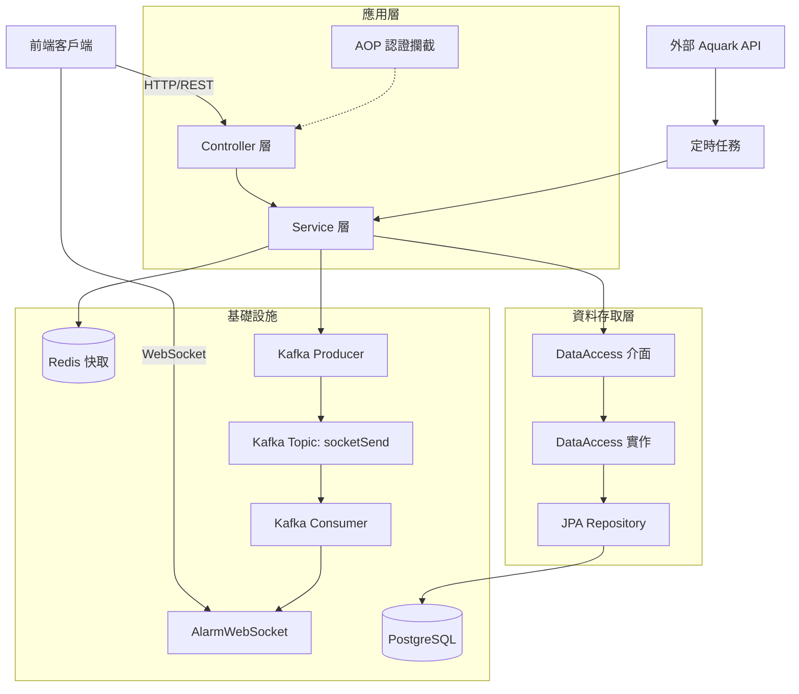

### 告警通知流程

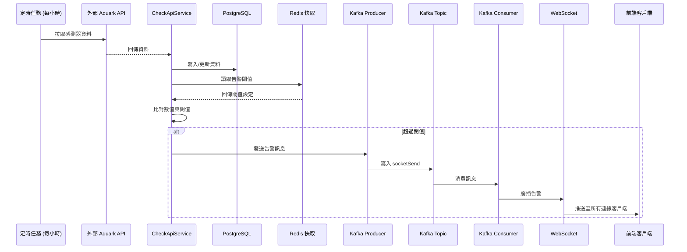

### 快取監控統計流程 🆕

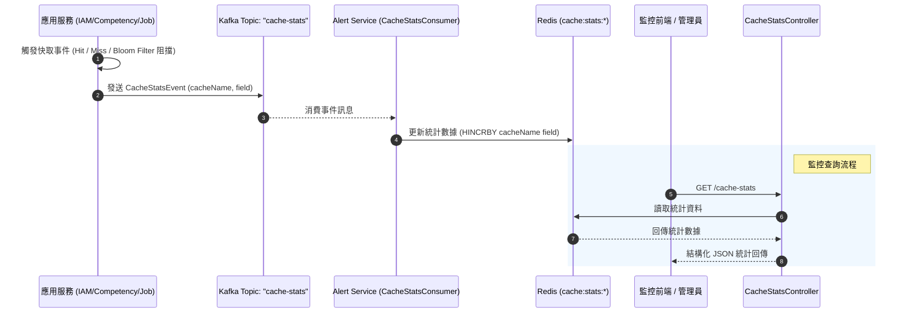

### 基礎設施拓撲

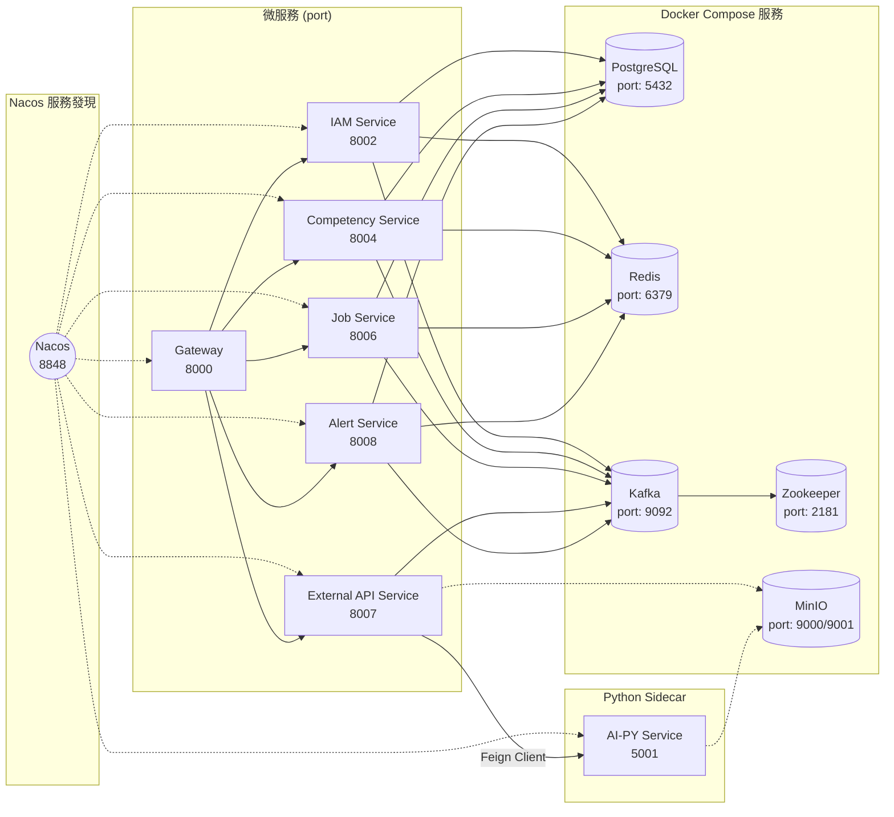

### 資料模型

系統採用分散式資料庫設計（Database-per-Service），各微服務資料庫完全隔離。按微服務業務領域將資料模型劃分為 4 大核心領域：

#### 1. 身份與權限管理領域 (IAM Service)

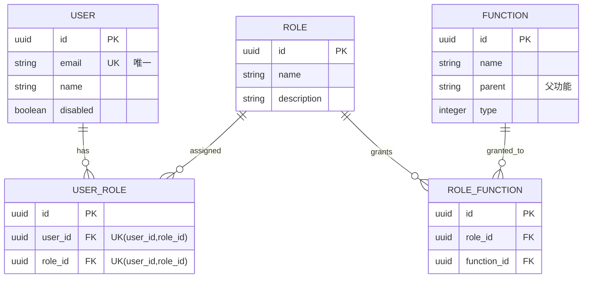

#### 2. 能力與專案管理領域 (Competency Service)

能力與專案管理領域涵蓋技能管理、專案管理以及專案成員技能等子模組。

##### A. 技能管理子模組

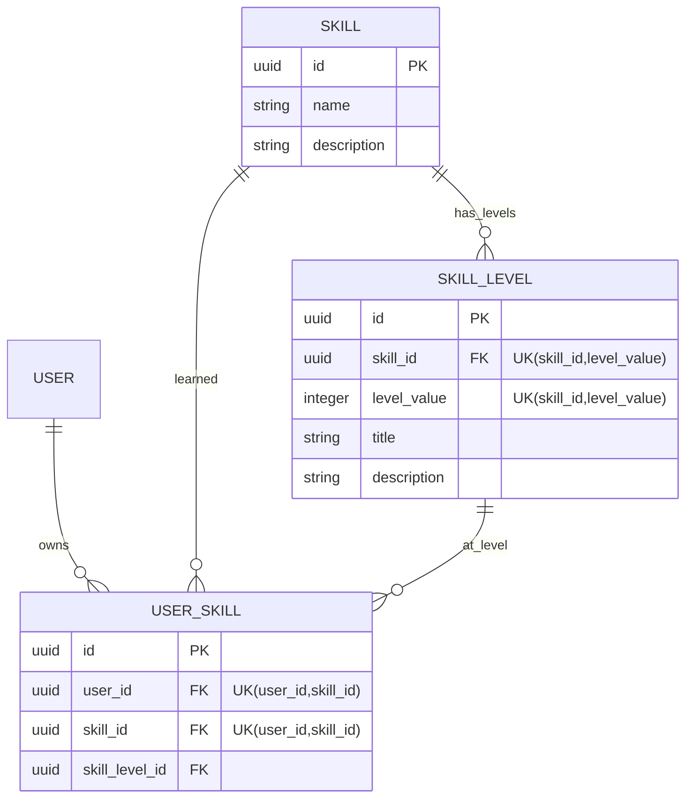

##### B. 專案管理子模組

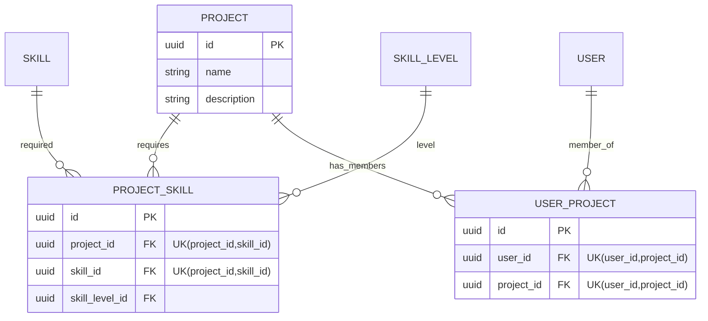

##### C. 專案成員技能子模組 🆕

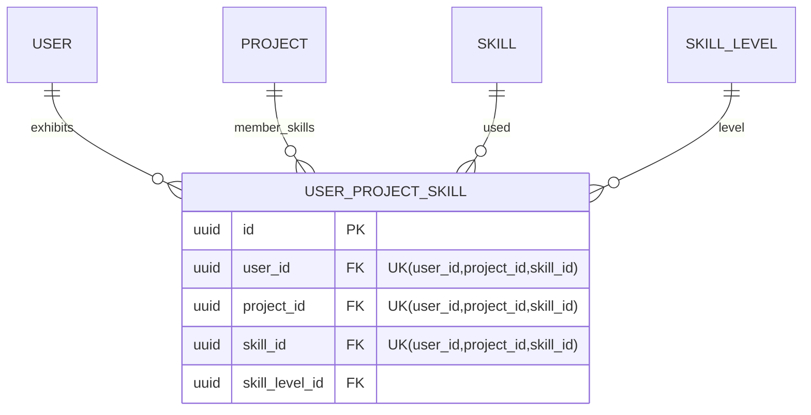

#### 3. 企業與職缺管理領域 (Job Service) 🆕

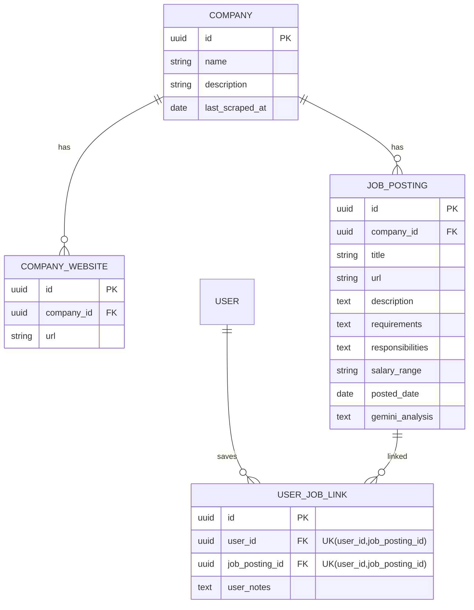

#### 4. 外部與 AI 代理服務領域 (External API Service) 🆕

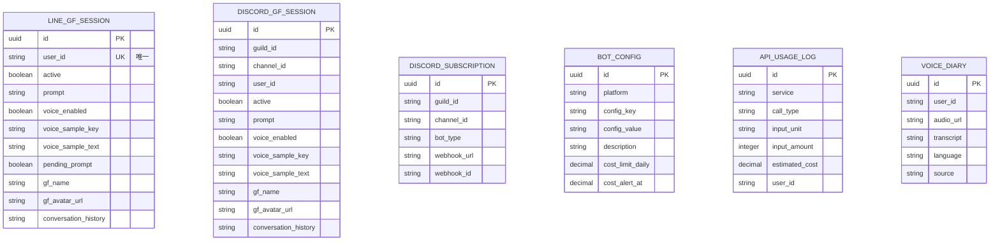

**核心資料表說明**：

| 資料表 | 類型 | 歸屬微服務 | 用途 | 唯一約束 |
|---|---|---|---|---|
| `user` | 主實體 | `backend-iam-service` | 使用者資訊 | email |
| `role` | 主實體 | `backend-iam-service` | 角色定義 | - |
| `function` | 主實體 | `backend-iam-service` | 功能權限（樹狀結構） | - |
| `user_role` | 關聯表 | `backend-iam-service` | 使用者角色綁定 | (user_id, role_id) |
| `role_function` | 關聯表 | `backend-iam-service` | 角色權限綁定 | - |
| `skill` | 主實體 | `backend-competency-service` | 技能定義 | - |
| `skill_level` | 主實體 | `backend-competency-service` | 技能等級（隸屬於技能） | (skill_id, level_value) |
| `project` | 主實體 | `backend-competency-service` | 專案資訊 | - |
| `user_skill` | 關聯表 | `backend-competency-service` | 使用者個人技能庫 | (user_id, skill_id) |
| `project_skill` | 關聯表 | `backend-competency-service` | 專案技能需求 | (project_id, skill_id) |
| `user_project` | 關聯表 | `backend-competency-service` | 專案成員 | (user_id, project_id) |
| `user_project_skill` | 關聯表 | `backend-competency-service` | 🆕 專案成員技能（使用者在特定專案的技能等級） | (user_id, project_id, skill_id) |
| `company` | 主實體 | `backend-job-service` | 公司/企業資訊 | - |
| `company_website` | 子實體 | `backend-job-service` | 🆕 企業相關網站連結（一對多關聯） | - |
| `job_posting` | 主實體 | `backend-job-service` | 職缺資訊（含 Gemini 分析結果） | - |
| `user_job_link` | 關聯表 | `backend-job-service` | 使用者儲存的職缺（個人收藏） | (user_id, job_posting_id) |
| `line_gf_session` | 主實體 | `backend-external-api-service` | LINE 女友聊天會話狀態 | user_id |
| `discord_gf_session` | 主實體 | `backend-external-api-service` | Discord 女友聊天會話狀態 | (channel_id, user_id) |
| `discord_subscription`| 主實體 | `backend-external-api-service` | Discord Webhook 訂閱設定 | - |
| `bot_config` | 主實體 | `backend-external-api-service` | 平台與機器人全局設定、用量水位 | - |
| `api_usage_log` | 審計表 | `backend-external-api-service` | 外部 API 呼叫用量與估算成本記錄 | - |
| `voice_diary` | 主實體 | `backend-external-api-service` | 語音日記轉譯記錄與音訊網址 | - |

**資料模型設計特點**：

- ✅ 所有 Entity 繼承 `BaseEntity`，自動擁有 `id` (UUID)
  、審計欄位 (`created_by`, `created_time`, `updated_by`, `updated_time`)
- ✅ 使用複合唯一約束防止重複綁定關係
- ✅ `user_project_skill` 為四向關聯表，支援「使用者在不同專案展現不同技能等級」的業務場景
- ✅ `skill_level` 與 `skill` 為一對多關係，確保等級定義與技能綁定
- ✅ `function` 支援樹狀結構（parent 欄位），實現階層式功能選單

## 服務名稱變更記錄

| 原名稱 | 新名稱 | 說明 |
|-------|-------|------|
| `backend-ai-service` | `backend-external-api-service` | 擴增職責為外部整合中心（LINE/Discord/Config/AI 代理） |
| `backend-project-skill-service` | `backend-competency-service` | 更貼近領域意涵：Competency = 技能 + 能力管理 |

## Database-per-Service

為實現微服務資料隔離，每個服務擁有獨立的 PostgreSQL 資料庫：

| 資料庫名稱 | 歸屬服務 | 主要 Entity |
|-----------|---------|------------|
| `iam_service` | backend-iam-service | User, Role, Function, UserRole, RoleFunction |
| `competency_service` | backend-competency-service | Project, Skill, SkillLevel, UserSkill, UserProject, ProjectSkill, UserProjectSkill |
| `job_service` | backend-job-service | Company, JobPosting, CompanyWebsite, UserJobLink |
| `external_api_service` | backend-external-api-service | VoiceDiary, BotConfig, ApiUsageLog, LineGfSession, DiscordGfSession, DiscordSubscription |
| `alert_service` | backend-alert-service | AquarkData, AlertCheckLimit |

## Python AI 側車服務 (`backend-ai-py`)

為了解決 Java 生態在 AI 推論方面的限制（語音辨識、語音合成、LLM Chat），引入 Python 側車架構：

- **語言**：Python 3.11 + FastAPI
- **服務名**：`ai-py-service`（Nacos 註冊）
- **Port**：`5001`
- **不經 Gateway**：由 `backend-external-api-service` 透過 Feign Client 直接內部呼叫
- **功能**：
  - **STT**：faster-whisper 語音辨識（SenseVoice 可選）
  - **TTS**：GPT-SoVIT HTTP API（主） + sherpa-onnx（備援）
  - **Chat**：Ollama API 聊天（不含 LangChain / Milvus / RAG）
  - **語者分離**：pyannote-audio 將多語者音訊拆分成單人音軌，再個別辨識

### Python 環境建置

```bash
# 建立 conda 環境（backend-ai-py，Python 3.11）
conda create -n backend-ai-py python=3.11
conda activate backend-ai-py
pip install -r backend-ai-py/requirements.txt

# 啟動服務（需先啟動 Docker 基礎設施與 Nacos，供服務註冊）
conda run -n backend-ai-py uvicorn main:app --port 5001
```

語者分離（pyannote-audio）需額外安裝（涉及 CUDA 版 PyTorch），完整步驟見 [`docs/archive/語者分離環境安裝說明.md`](docs/archive/語者分離環境安裝說明.md)。

## 技術選型說明

| 技術                    | 用途           | 選型原因                                            |
|-----------------------|--------------|-------------------------------------------------|
| **Java 21**           | 程式語言         | LTS 版本，支援虛擬執行緒、Record Patterns 等新特性             |
| **Spring Boot 3.4.2** | 核心框架         | 生態系完整、自動配置簡化開發、內建 Actuator 監控                   |
| **Spring Data JPA**   | ORM 框架       | 減少樣板程式碼、支援 Specification 動態查詢、與 Spring 生態無縫整合   |
| **PostgreSQL**        | 關聯式資料庫       | 開源、支援 JSONB/UUID/陣列等進階型別、效能優異                   |
| **Redis**             | 快取層          | 高效能、支援多種資料結構、Spring Cache 原生整合                  |
| **Kafka**             | 非同步訊息佇列      | 高吞吐、持久化、支援消費者群組，適合事件驅動架構                        |
| **WebSocket**         | 即時通訊         | 全雙工通訊，適合告警即時推送場景                                |
| **jose4j**            | JWT 處理       | 支援 JWS/JWE 標準、API 設計清晰、安全性高                     |
| **MapStruct**         | Vo 映射        | 編譯期產生程式碼、效能優於反射、型別安全                            |
| **Lombok**            | 程式碼簡化        | 減少 getter/setter/constructor 樣板程式碼              |
| **Jsoup**             | HTML 解析與網頁爬蟲 | 輕量級靜態頁面爬取，支援 CSS Selector 與 DOM 操作，適合結構化頁面      |
| **Selenium**          | 動態網頁爬蟲       | 瀏覽器自動化工具，處理 JavaScript 渲染頁面，作為 Jsoup 的 fallback |
| **Kuromoji**          | 日文 NLP 工具    | 日文形態素分析與片假名拼音萃取                                 |
| **Pinyin4j/Bopomofo** | 中文拼音/注音轉換   | 中文字轉漢語拼音及注音符號轉換引擎                               |
| **opencc4j**          | 簡繁中文轉換      | STT 辨識結果由簡體轉換為繁體中文輸出                             |
| **Gemini API**        | AI 智能分析      | Google Gemini REST API，用於從爬取內容中結構化萃取職缺資訊        |
| **Groq API**          | AI 模型推論（備援）  | 低延遲推論晶片 LPU，作為 Gemini 備援方案                        |
| **DeepSeek API**      | AI 模型推論（備援）  | 開源大語言模型 API，作為 Gemini 備援方案                        |
| **GitHub Models API** | AI 模型推論（備援）  | 透過 Azure AI 存取多種模型，作為 Gemini 備援方案                 |
| **Gson**              | JSON 序列化     | Google 官方 JSON 庫，用於 Gemini API 請求/回應處理          |
| **Docker Compose**    | 本地開發環境       | 一鍵啟動所有依賴服務、環境一致性高                               |
| **JUnit 5 + Mockito** | 測試框架         | 業界標準、支援參數化測試、Mock 功能完善                          |
| **JaCoCo**            | 覆蓋率工具        | 與 Maven 無縫整合、支援 XML/HTML 報告                     |

## 功能模組拆分

| 模組          | 說明                                                    | 主要端點                          |
|-------------|-------------------------------------------------------|-------------------------------|
| **認證授權模組**  | JWT 簽發與驗證、RBAC 權限模型 (User → Role → Function)          | `/auth/login`, `/auth/signup` |
| **使用者管理模組** | 使用者 CRUD、技能綁定、專案綁定、角色綁定、分頁搜尋                          | `/users/*`                    |
| **專案管理模組**  | 一般/個人專案管理、技能綁定、成員技能管理、擁有者權限控制                         | `/project/*`                  |
| **技能管理模組**  | 技能/等級 CRUD、個人/專案維度技能管理                                | `/skill/*`                    |
| **角色與功能模組** | 角色/功能 CRUD、雙向綁定、階層式功能選單                               | `/role/*`, `/function/*`      |
| **管理者綁定模組** | 統一管理使用者-專案、使用者-技能、專案-技能、專案成員技能等多對多綁定關係，採用完整覆蓋式 API 設計 | `/admin/bindings/*`           |
| **公司管理模組**  | 公司 CRUD，作為職缺的隸屬企業                                     | `/company/*`                  |
| **職缺管理模組**  | 職缺 CRUD、依公司查詢、爬蟲結果儲存                                  | `/job-posting/*`              |
| **爬蟲分析模組**  | Jsoup/Selenium 複合爬蟲抓取公司網站 + Gemini API 智能分析職缺資訊       | `內部服務`                        |
| **AI 語音辨識模組**| 透過 Java 整合 Python sidecar (faster-whisper) 進行高效率語音辨識、支援 LINE 音訊流程與 MinIO 雲端儲存，並提供中日文羅馬音/注音/拼音轉換 | `/stt/v1/*` 與 `POST /ai/inner/stt/recognize` |
| **Python TTS 模組** | 透過 Python sidecar (GPT-SoVIT) 提供語音合成，儲存至 MinIO 回傳 URL | `POST /ai/inner/tts/synthesize` |
| **Ollama Chat 模組** | 透過 Python sidecar 呼叫 Ollama 語言模型，支援同步/串流 | `POST /ai/inner/chat` |
| **告警通知模組**  | 定時拉取外部資料、閾值比對、Kafka 非同步推送、WebSocket 即時通知              | `/alertCheckLimit/*`          |
| **資料查詢模組**  | Aquark 感測器資料查詢、動態條件過濾、Redis 快取                        | `/aquarkData/*`               |
| **快取統計監控模組** | Kafka-based 快取命中/未命中/Bloom Filter 阻擋統計，聚合至 Redis Hash 提供查詢 | `/cache-stats`                |
| **LINE Bot 模組** | LINE Messaging API 整合，支援文字/音訊訊息處理、用量追蹤 | `/api/external/line/callback` |
| **Discord Bot 模組** | Java Discord API (JDA) 整合，支援 Slash 指令啟用女友對話、提示詞設定、語音回覆、自訂女友名稱與頭像 | 內部 WebSocket 連線 |
| **外部 Config 管理** | 動態配置管理（平台 + 金鑰），支援用量限制設定 | `/api/external/config/**` |
| **用量追蹤模組** | 各服務呼叫記錄、成本估算、每日額度檢查 | `/api/external/usage/**` |

## 工程實踐

### 層級架構設計
- Controller → Service → DataAccess Interface → DataAccessImpl → Repository → JPA/Hibernate
- DataAccess 層將資料存取邏輯從 Service 中分離，便於測試與替換實作。

### 模組依賴隔離 (Dependency Isolation)
為了解決微服務架構中常見的全域依賴過重問題（Jar Hell）與啟動效能問題，專案實作了嚴格的依賴隔離策略：
- Parent POM (`pom.xml`) 僅負責版本管理 (`<dependencyManagement>`) 與極少數的全域基礎依賴（如 Lombok, MapStruct 等）。
- 各微服務子模組依照其領域職責（例如：`backend-job-service` 需要爬蟲工具、`backend-external-api-service` 需要語音辨識與 NLP 套件），各自明確宣告所需的 `<dependencies>`，徹底避免無用類別庫的強迫載入，顯著降低不需要該依賴之服務（如 API Gateway）的啟動時間與編譯體積。

### 快取策略

- 使用 Spring Cache 抽象層（`@Cacheable` / `@CachePut` / `@CacheEvict`），Redis JSON 序列化
- 三層級 TTL 策略：參考資料（6-24h）、業務資料（30m-6h）、使用者資料（10-30m）
- 支援快取穿透防護（Bloom Filter + Null Value）、雪崩防護（TTL 隨機化 + 分散式鎖 + `sync=true`）、清單安全包裝（`CacheListWrapper`）及快取統計監控（Kafka-based）
- 詳盡的策略說明、TTL 配置、Evict 策略與實作細節請見 [`docs/archive/redis快取策略.md`](docs/archive/redis快取策略.md)

**快取是怎麼運作的？** 全專案共有 43 處 `@Cacheable`，散佈在 User / Role / Function / Skill / Project / JobPosting / Company / UserJobLink / AquarkData / AlertCheckLimit 等 Service 上。為了讓第一次讀的人能看懂，重點說明三件事：

1. **Key 設計**：與業務語意一致，例如 `'user:...'`、`'all'`、`'byuser:'`、`'search:'+query`，避免 Key 碰撞。
2. **清單安全包裝**：直接快取 `List` 會有型別擦除問題，所以回傳清單的方法都改用 `com.example.BackendArchitectureLab.Vo.Cache.CacheListWrapper` 包裹。
3. **穿透/雪崩防護**：高併發查詢同一把快取 Key 時（如 Search API），若快取 miss 所有人都會同時打到 DB。`CachePenetrationProtectionCache` 用 Semaphore（預設容量 10）限流 + Redisson 分散式鎖保護，只讓一個執行緒去 DB 載入再回填快取。500 併發壓力測試中此機制防止了 DB 擊穿（但同時產生了「Semaphore 排隊 30 秒超時」的副作用，詳見 [未來優化](#未來優化)）。

### 非同步事件處理

- 整合 Kafka 消息佇列，構建高性能、低延遲的事件驅動與非同步解耦架構
- 涵蓋即時告警廣播 (`socketSend`)、分散式交易補償 (`transaction-compensation`) 以及跨服務快取指標監控 (`cache-stats`) 三大核心業務
- 支援消費者群組負載均衡（預設 `myGroup`）、批量拉取消費與 Spring Kafka 自動化重試及異常處理（`DefaultErrorHandler`）

**三大主題的實作位置**：

| 主題 | 誰發佈 | 誰消費 | 目的 |
|------|--------|--------|------|
| `socketSend` | `AlarmKafkaPublisher`（alert）| `KafkaConsumerService` | 告警即時推送到 WebSocket |
| `transaction-compensation` | 跨服務寫操作（TransactionManager） | `CompensationConsumer`（alert） | 分散式事務補償（含 transactionId/action/status） |
| `cache-stats` | `KafkaCacheStatsPublisher`（common） | `CacheStatsConsumer`（alert） | 快取命中/Bloom 阻擋統計聚合至 Redis Hash，供 `/cache-stats` 查詢 |

消費者群組預設 `myGroup`，執行時以 `KafkaConfig`（backend-common）依環境自動解析 Broker（本機 `localhost:9092`、Docker 內 `kafka:9092`）。

### Spring Security 認證攔截

- 整合 `spring-boot-starter-security`，使用 `SecurityFilterChain` 與自訂 `JwtAuthenticationFilter`
- JWT 驗證失敗直接回傳 401，不進入業務邏輯
- 通過驗證後將 CustomUserDetails 物件注入 `SecurityContextHolder` 供後續存取
- 利用 `IgnoreUrlsProvider` 動態掃描 `@Ingnore` 註解，自動配置 `permitAll()` 規則，並保留原本簡潔的開發體驗
- 透過 `@RequirePermission({"System", "Function", "View"})` 註解在 Controller 方法上，宣告「模組 + 功能 + 操作」三層權限，
  由 AOP 攔截器自動檢查當前使用者的角色是否具備對應功能權限
- 登入機制改用 Spring Security 內建之 `AuthenticationManager` 處理密碼比對
- 密碼儲存與驗證改用 `DelegatingPasswordEncoder`：預設使用 `bcrypt` 進行加密 (新密碼會帶有 `{bcrypt}` 前綴)
  ，同時向下相容舊資料庫中未帶前綴的裸 bcrypt 密碼，保有未來無縫切換其他加密演算法 (如 Argon2) 的擴充彈性

### 動態查詢

- 使用 JPA Specification 實現分頁與多條件搜尋
- 複雜查詢 (AquarkData) 使用 Criteria API 動態建構

### Vo 映射

- MapStruct 編譯期產生映射程式碼，效能優於反射
- 支援 `@AfterMapping` 處理複雜轉換 (如權限解析)

### 測試與覆蓋率

- JUnit 5 + Mockito 單元測試
- H2 in-memory database 隔離測試環境
- JaCoCo 覆蓋率要求 ≥ 80% (排除介面、Entity、Vo 等樣板層)

### Docker Compose 本地開發

- 一鍵啟動 PostgreSQL、Redis、Kafka、Zookeeper、MinIO 等服務
- 環境變數模板化 (`.env.example`)，便於團隊協作

### 統一例外處理

- `GlobalExceptionHandler` 集中處理所有異常
- 標準化回應格式：`ResponseType<T>` (code, data, message, errorType)
- 自訂 `AppException` 支援 HTTP 狀態碼與錯誤型別設定


## CI/CD Pipeline

專案導入 GitHub Actions 建立 Pull Request 自動化驗證流程。

### Pull Request Flow

    Developer
    ↓
    Create Pull Request
    ↓
    GitHub Actions
    ↓
    Maven Build
    ↓
    Unit Test
    ↓
    JaCoCo Coverage Check
    ↓
    AI Code Review
    ↓
    Merge Validation
    ↓
    Approve & Merge
## 未來優化方向

> 來源：500 併發壓力測試（`stress-test/壓力測試結果.md`）。核心矛盾：**Search API 的快取加速與 Semaphore 穿透防護互相衝突**——`@Cacheable(sync=true)` 在快取全 miss 時，所有請求同時排隊等 Semaphore(10) 重建快取，30 秒超時直接回 500；反而「不加快取」時錯誤率 0%。三方案比較：

| 方案 | 作法 | 結果 |
|------|------|------|
| **A（推薦）** | 移除 Search 類非單筆查詢的 `@Cacheable` | 徹底消除排隊，換取無快取但穩定（錯誤率 0%） |
| B | Semaphore 容量調高至 50/100 | 減少排隊但治標不治本，仍有超時風險 |
| C | `sync=false`（關閉同步回填） | 並發回填改為各自寫入，失去合併請求效益，需搭配 TTL 隨機化 |

- 若未來採虛擬執行緒（Virtual Threads），需注意 Carrier Pinning 對 Semaphore/鎖的影響。
- 其餘方向（向量檢索 Milvus、多 Agent 協作等）見下方 Roadmap。

## Roadmap

### Infrastructure

- [x] Prometheus Metrics (僅 alert-service)
- [x] Grafana (基礎配置，無預設儀表板)
- [ ] Centralized Logging
- [ ] ELK Stack

### Architecture

- [ ] Outbox Pattern
- [ ] Distributed Lock
- [ ] Event Replay Mechanism
- [ ] Saga Pattern Evaluation

### Quality

- [ ] Testcontainers Integration Test
- [ ] SonarQube Static Analysis
- [ ] Performance Benchmark
- [ ] Security Audit Automation

### AI Integration

- [ ] Python AI 側車服務 (`backend-ai-py`) 向量檢索優化 (評估 Milvus 向量資料庫整合)
- [ ] Multi-Agent 協作與複雜任務流調度

## 提供的介面類型

- REST API
- WebSocket
- Kafka Consumer

## 🤖 AI 語音辨識功能 (STT) 說明

本專案採用 **Java + Python 協作架構**，將語音推論交由 Python 側車服務 (`backend-ai-py`) 執行。透過高效率的 `faster-whisper` 推論引擎，不僅提升了辨識速度，也消除了 Java 原生 JNI 與 FFmpeg 轉檔庫的複雜依賴。

### 運作架構

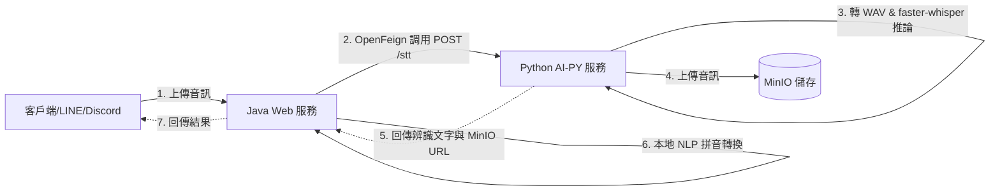

1. **音訊上傳與中繼**：Java 服務接收音訊檔案後，不進行本地轉檔，直接透過 Feign Client 將音訊原始位元組轉發至 Python 側車服務 (`backend-ai-py`) 的 `/stt` 端點。
2. **高效推論與雲端儲存**：Python 服務將音訊自動轉為標準 16kHz WAV 格式，使用 `faster-whisper` 執行語音轉文字（STT），同時將音訊自動上傳至 MinIO 物件儲存，並計算音訊長度。
3. **本地 NLP 拼音轉換**：Java 服務接收到 Python 回傳的文字後，使用 JVM 本地 NLP 引擎（如 `opencc4j`, `Pinyin4j`, `Kuromoji`）完成繁簡轉換、注音、漢語拼音或日文羅馬拼音的精密轉換，最終回傳。

---

### 提供之 API 介面

#### 1. 前端/拼音轉換整合介面：`POST /stt/v1/{lan}/{mode}`
由 Java `LearnController` 提供，整合了 STT 與本地 NLP 拼音注音轉換：
* **路徑參數**:
  * `lan`: 辨識目標語言。支援 `zh` (繁體中文), `ja` (日文)
  * `mode`: 拼音輸出模式。支援 `pinyin` (拼音), `zhuyin` (注音), `romaji` (日文羅馬拼音), `none` (不輸出拼音)
* **請求參數**:
  * `file`: 音訊檔案 (MultipartFile，支援 MP3/WAV/M4A/AMR 等)
* **CURL 測試範例**:
  ```bash
  curl -X POST "http://localhost:8000/stt/v1/zh/zhuyin" \
       -H "Content-Type: multipart/form-data" \
       -F "file=@/path/to/your/audio.mp3"
  ```

#### 2. 內部通用辨識介面：`POST /ai/inner/stt/recognize`
由 Java `AiInternalController` 提供，供 Discord Bot、LINE Bot 等背景服務直接獲取辨識結果與音訊檔案儲存 URL：
* **請求參數**:
  * `file`: 音訊檔案 (MultipartFile)
  * `language`: 辨識目標語言 (String，預設 `zh`)
* **回應格式 (SttResponseVo)**:
  ```json
  {
    "text": "語音辨識內容",
    "language": "zh",
    "duration_sec": 4.52,
    "audio_url": "http://localhost:9000/ai-audio/stt/2026/06/xxx.wav"
  }
  ```

---

### Python 側端模型與推論設定

可在 Python 側車服務中的 `.env` 檔案中設定以下參數來調校 `faster-whisper`：
* `WHISPER_MODEL_SIZE`: 模型大小。預設為 `base`（支援 `tiny`, `small`, `medium`, `large-v3` 等）。
* `WHISPER_DEVICE`: 運作裝置。預設為 `cpu`（若有 NVIDIA 顯卡可設為 `cuda`）。
* `WHISPER_COMPUTE_TYPE`: 計算精度。預設為 `int8`（如使用 GPU 可改為 `float16` 以提升推論速度）。

## 啟動方式

本專案採用微服務架構，啟動流程分為「基礎設施」→「微服務」兩階段。

### Phase 0：前置準備

```bash
# 1. 複製環境變數模板
cp .env.example .env
# 編輯 .env 填入必要的 API Key（GEMINI_API_KEY, GROQ_API_KEY 等）
```

### Phase 1：啟動基礎設施

使用 Docker Compose 啟動 PostgreSQL、Redis、Kafka、MinIO、Nacos 等依賴服務：

```bash
docker compose -f compose.yaml up -d
```

### Phase 2：啟動 Python AI 側車服務

Python 側車服務 (AI-PY) 提供 STT/TTS/Chat 功能，不經 Gateway，由 External API Service 直接呼叫：

```bash
conda run -n backend-ai-py uvicorn main:app --port 5001
```

### Phase 3：啟動微服務

**選項 B：個別啟動（開發除錯）**

依序在獨立終端機中執行：

```bash
# 啟動順序：iam-service → 其他服務 → gateway（最後）
./mvnw spring-boot:run -pl backend-iam-service
./mvnw spring-boot:run -pl backend-competency-service
./mvnw spring-boot:run -pl backend-job-service
./mvnw spring-boot:run -pl backend-external-api-service
./mvnw spring-boot:run -pl backend-alert-service
./mvnw spring-boot:run -pl backend-gateway
```

### 服務埠一覽

| 服務 | Port | 說明 |
|------|------|------|
| Gateway | `8000` | API 入口閘道 |
| IAM Service | `8002` | 身分識別與授權 |
| Competency Service | `8004` | 專案與技能管理 (原 Project-Skill Service) |
| Job Service | `8006` | 職缺管理 |
| External API Service | `8007` | 外部整合、AI 代理、LINE/Discord Bot (原 AI Service) |
| Alert Service | `8008` | 告警通知 |
| AI-PY Service | `5001` | Python 側車服務 (STT/TTS/Chat，不經 Gateway) |
| Nacos | `8848` | 服務發現主控台 |

### 外部服務入口 (LINE Bot / Discord Bot)

LINE Bot 與 Discord Bot 的完整設定說明（Webhook URL、Token 申請、頻道訂閱）請見 [`docs/archive/外部入口說明.md`](docs/archive/外部入口說明.md)

#### 所需外部服務與憑證變數

| 服務 | 用途 | 必要環境變數 | 啟動條件 |
|------|------|--------------|----------|
| **LINE** | GF / Diary 聊天機器人（Webhook 回呼 LINE 伺服器） | `LINE_CHANNEL_*`、`LINE_DIARY_CHANNEL_*`（Channel Secret / Token） | 需 ngrok 對外轉發至 Gateway `8000` |
| **Discord** | GF / Diary 機器人（WebSocket 長連線，不需對外 Webhook） | `DISCORD_GF_TOKEN`、`DISCORD_DIARY_TOKEN` | 直接可用 |
| **ngrok** | 將本機 Gateway 對外暴露供 LINE 回呼 | -（安裝：`winget install ngrok`，啟動：`ngrok http 8010`） | 僅 LINE 需要 |
| **Ollama** | Python 側車 Chat 能力的本地 LLM | - | `localhost:11434`（如 gemma2 等模型） |
| **GPT-SoVIT** | TTS 語音合成（主選） | - | `http://127.0.0.1:9880/tts`（亦有 sherpa-onnx 備援） |
| **backend-ai-py** | Python AI 側車（STT/TTS/Chat） | - | `conda env backend-ai-py` + `uvicorn main:app --port 5001` |

> 注意：缺任一服務時系統仍可啟動（對應功能會回「未啟用」），資料庫/Redis/Kafka 等基礎設施必需。LINE 語音回覆目前關閉（`LineGfService.voiceEnable`），因免費 ngrok 會攔截音訊。

### Docker 內啟動 Gateway

若需將 Gateway 部署至 Docker：

```bash
# 使用 dockerBuild.bat（建置映像 + 啟動基礎設施）
.\dockerBuild.bat

# 或手動建置與執行
docker build -t backend-gateway:latest .
docker run -p 8000:8000 --network my_network backend-gateway:latest
```

### Kafka 連線設定

| 執行環境 | 設定值 |
|---------|--------|
| 本機開發 | `KAFKA_ADVERTISED_HOST=localhost`（預設） |
| Docker 內執行 | `APP_IN_DOCKER=true`（自動切換為 `kafka:9092`） |

## 重要設定

- Gateway 埠：`8000`
- JWT Secret：`jwt.secret.use`
- PostgreSQL：`localhost:5432`
- Redis：`localhost:6379`
- Kafka：`localhost:9092`
- Gemini API：需設定 `GEMINI_API_KEY` 環境變數（`.env` 或系統環境變數），API
  端點預設 `https://generativelanguage.googleapis.com/v1beta/models/gemini-2.0-flash-exp:generateContent`

可在 `compose.yaml` 查看各服務連線設定。

## 常見問題排除

### Kafka 連線失敗

**症狀：**

```
ERROR o.a.k.c.NetworkClient - Connection to node -1 (localhost/127.0.0.1:9092) could not be established
```

**原因與解決方案：**

| 執行環境       | 原因                   | 解決方案                                 |
|------------|----------------------|--------------------------------------|
| 本機開發       | Kafka 廣播地址設定為容器名稱    | 設定 `KAFKA_ADVERTISED_HOST=localhost` |
| Docker 內執行 | 應用程式無法解析 `localhost` | 設定 `APP_IN_DOCKER=true`              |
| 混合環境       | 網路隔離                 | 檢查 Docker network 設定                 |

**驗證步驟：**

```bash
# 1. 確認 Kafka 容器運行中
docker ps | grep kafka

# 2. 測試 Kafka 可達性
docker exec -it kafka kafka-topics --bootstrap-server kafka:9092 --list

# 3. 檢查應用程式日誌
tail -f logs/spring.log | grep kafka
```

---

### Redis 連線問題

**症狀：**

```
io.lettuce.core.RedisConnectionException: Unable to connect to localhost:6379
```

**解決步驟：**

```bash
# 1. 確認 Redis 運行中
docker ps | grep redis

# 2. 測試 Redis 連線
docker exec -it redis_container redis-cli ping
# 預期回應：PONG

# 3. 若啟用密碼，測試認證
docker exec -it redis_container redis-cli -a redisPd ping
```

**注意事項：**

- 預設 Redis **未啟用密碼**（compose.yaml line 25 已註解）
- 若要啟用密碼，取消註解 `compose.yaml` line 25

---

### PostgreSQL 連線錯誤

**症狀 1：資料庫不存在**

```
PSQLException: FATAL: database "xxx" does not exist
```

**解決方案：**

```bash
# 進入 PostgreSQL 容器
docker exec -it postgres_db_backend psql -U postgres

# 建立資料庫（若需要）
CREATE DATABASE your_db_name;
```

**症狀 2：密碼認證失敗**

```
PSQLException: FATAL: password authentication failed for user "postgres"
```

**檢查項目：**

1. 確認 `.env` 中的 `POSTGRES_PASSWORD` 與 `application.yml` 一致
2. 檢查 `SPRING_DATASOURCE_PASSWORD` 環境變數
3. 若修改密碼後，需重啟容器：
   ```bash
   docker compose down -v  # -v 會刪除 volume，慎用
   docker compose up -d
   ```

---

### JPA DDL 自動更新問題

**症狀：**

```
Caused by: org.hibernate.tool.schema.spi.SchemaManagementException: Unable to execute schema management to JDBC target
```

**檢查項目：**

1. 確認使用者有 DDL 權限（CREATE TABLE, ALTER TABLE）
2. 檢查 `application.yml` 中的 `spring.jpa.hibernate.ddl-auto` 設定
    - `update`：自動更新 schema（開發環境）
    - `validate`：僅驗證 schema（生產環境建議）
    - `none`：不執行任何操作

**生產環境建議：**

- 改用 Flyway 或 Liquibase 管理資料庫版本
- 禁用 Hibernate DDL 自動更新

---

### WebSocket 連線失敗

**症狀：**
前端無法建立 WebSocket 連線

**檢查項目：**

```javascript
// 前端連線範例
const ws = new WebSocket('ws://localhost:8000/ws/alarm');

ws.onopen = () => console.log('Connected');
ws.onerror = (error) => console.error('Connection failed:', error);
```

**常見原因：**

1. CORS 設定錯誤（檢查 `WebSocketConfig.java`）
2. 防火牆阻擋 WebSocket 連線
3. Nginx 反向代理需額外設定：
   ```nginx
   location /ws/ {
       proxy_pass http://backend:8000;
       proxy_http_version 1.1;
       proxy_set_header Upgrade $http_upgrade;
       proxy_set_header Connection "upgrade";
   }
   ```

## 安全性配置指南

### 🚨 生產環境必改項目

以下配置項目**絕對不可**使用預設值，否則存在嚴重安全風險：

#### 1. JWT Secret Key

**風險等級：** 🔴 **嚴重**

**預設值（開發用）：**

```yaml
jwt:
  secret:
    use: secretsecretsecretsecretsecretll  # ⚠️ 生產環境禁止使用
```

**生產環境設定：**

```bash
# 生成強隨機密鑰（至少 256 bits）
openssl rand -base64 32

# 設定環境變數
export JWT_SECRET_USE="你生成的隨機密鑰"
```

**Kubernetes Secret 範例：**

```yaml
apiVersion: v1
kind: Secret
metadata:
  name: backend-secrets
type: Opaque
data:
  jwt-secret: <base64-encoded-secret>
```

---

#### 2. 資料庫密碼

**風險等級：** 🔴 **嚴重**

**不安全的做法：**

```yaml
# ❌ 密碼寫死在 application.yml
spring:
  datasource:
    password: verYs3cret
```

**安全做法：**

```bash
# 使用環境變數
export SPRING_DATASOURCE_PASSWORD="$(openssl rand -base64 24)"

# 或使用 Secrets Manager（AWS/GCP/Azure）
# AWS 範例：
export SPRING_DATASOURCE_PASSWORD="$(aws secretsmanager get-secret-value --secret-id db-password --query SecretString --output text)"
```

**PostgreSQL 密碼強度建議：**

- 長度 ≥ 16 字元
- 包含大小寫字母、數字、特殊符號
- 避免使用字典單字

---

#### 3. Redis 密碼保護

**目前狀態：** ⚠️ **未啟用密碼**

**啟用步驟：**

1. 修改 `compose.yaml`（取消註解 line 25）：

```yaml
redis:
  # 選項 A：直接寫密碼（不建議）
  # command: redis-server --requirepass redisPd
  # 選項 B：使用環境變數（建議）
  command: redis-server --requirepass ${REDIS_PASSWORD}
```

2. 修改 `application.yml`：

```yaml
spring:
  data:
    redis:
      password: ${REDIS_PASSWORD:redisPd}
```

3. 生產環境密碼生成：

```bash
export REDIS_PASSWORD="$(openssl rand -base64 20)"
```

---

#### 4. Super User Key

**風險等級：** 🟡 **中等**

**用途：** 建立管理員帳號的一次性密鑰

**設定：**

```bash
# 生產環境設定唯一密鑰
export SUPERUSER_KEY="$(uuidgen)-$(openssl rand -base64 16)"
```

**使用後建議：**

- 建立管理員帳號後，立即更換或刪除此密鑰
- 記錄使用日誌以供審計

---

### 🛡️ 建議啟用的安全機制

#### 1. API Rate Limiting（速率限制）

**目的：** 防止 API 濫用與 DDoS 攻擊

**實作選項：**

**選項 A：使用 Bucket4j + Spring Cache**

```xml

<dependency>
    <groupId>com.bucket4j</groupId>
    <artifactId>bucket4j-core</artifactId>
    <version>8.7.0</version>
</dependency>
```

**選項 B：使用 Spring Cloud Gateway（若引入）**

```yaml
spring:
  cloud:
    gateway:
      routes:
        - id: backend
          filters:
            - name: RequestRateLimiter
              args:
                redis-rate-limiter.replenishRate: 10  # 每秒補充 10 個 token
                redis-rate-limiter.burstCapacity: 20  # 最多累積 20 個 token
```

**建議限制：**

- 未認證請求：10 req/min
- 已認證使用者：100 req/min
- 管理員：1000 req/min

---

#### 2. CORS 細部控制

**目前狀態：** 需檢查 `WebSocketConfig.java` 與 Security 配置

**生產環境配置範例：**

```java

@Configuration
public class CorsConfig {
    @Bean
    public CorsConfigurationSource corsConfigurationSource() {
        CorsConfiguration config = new CorsConfiguration();

        // ❌ 不安全：允許所有來源
        // config.addAllowedOrigin("*");

        // ✅ 安全：明確指定允許的來源
        config.setAllowedOrigins(Arrays.asList(
                "https://yourdomain.com",
                "https://app.yourdomain.com"
        ));

        config.setAllowedMethods(Arrays.asList("GET", "POST", "PUT", "DELETE"));
        config.setAllowedHeaders(Arrays.asList("Authorization", "Content-Type"));
        config.setAllowCredentials(true);
        config.setMaxAge(3600L);

        UrlBasedCorsConfigurationSource source = new UrlBasedCorsConfigurationSource();
        source.registerCorsConfiguration("/**", config);
        return source;
    }
}
```

---

#### 3. 輸入驗證統一處理

**檢查項目：**

✅ **已實作：**

- 統一例外處理（`GlobalExceptionHandler`）
- 標準化回應格式（`ResponseType<T>`）

⚠️ **建議補強：**

**Controller 層驗證：**

```java

@PostMapping("/signup")
public ResponseType<Token> signup(@Valid @RequestBody SignupRequest request) {
    // @Valid 觸發 Bean Validation
}
```

**Vo 驗證規則：**

```java
public class SignupRequest {
    @NotBlank(message = "Email cannot be blank")
    @Email(message = "Invalid email format")
    private String email;

    @NotBlank
    @Size(min = 8, message = "Password must be at least 8 characters")
    @Pattern(regexp = "^(?=.*[A-Z])(?=.*[a-z])(?=.*\\d).*$",
            message = "Password must contain uppercase, lowercase, and digit")
    private String password;
}
```

**全域驗證例外處理：**

```java

@ExceptionHandler(MethodArgumentNotValidException.class)
public ResponseEntity<ResponseType<?>> handleValidationExceptions(
        MethodArgumentNotValidException ex) {
    Map<String, String> errors = new HashMap<>();
    ex.getBindingResult().getFieldErrors().forEach(error ->
            errors.put(error.getField(), error.getDefaultMessage())
    );
    return ResponseEntity.badRequest()
            .body(new ResponseType<>(-1, errors, "Validation failed"));
}
```

---

#### 4. SQL Injection 防護

**目前狀態：** ✅ 已使用 JPA，風險較低

**需注意：**

- 檢查是否有使用 `@Query` 與 native query
- 若有，確保使用參數綁定而非字串拼接

**不安全範例：**

```java
// ❌ 危險：SQL Injection 風險
@Query(value = "SELECT * FROM users WHERE email = '" + email + "'", nativeQuery = true)
User findByEmailUnsafe(String email);
```

**安全範例：**

```java
// ✅ 安全：使用參數綁定
@Query(value = "SELECT * FROM users WHERE email = :email", nativeQuery = true)
User findByEmailSafe(@Param("email") String email);
```

**檢查指令：**

```bash
# 搜尋專案中的 native query
grep -r "@Query.*nativeQuery.*true" src/
```

---

#### 5. 敏感資料遮罩（日誌輸出）

**風險：** 密碼、Token 等敏感資料可能被記錄在日誌中

**解決方案：**

**選項 A：使用 Logback 遮罩規則**

```xml
<!-- logback-spring.xml -->
<configuration>
    <appender name="CONSOLE" class="ch.qos.logback.core.ConsoleAppender">
        <encoder class="ch.qos.logback.core.encoder.LayoutWrappingEncoder">
            <layout class="ch.qos.logback.classic.PatternLayout">
                <pattern>%d{HH:mm:ss.SSS} [%thread] %-5level %logger{36} - %msg%n</pattern>
            </layout>
            <charset>UTF-8</charset>
        </encoder>
        <filter class="com.example.BackendArchitectureLab.Filter.SensitiveDataMaskingFilter"/>
    </appender>
</configuration>
```

**選項 B：Vo 層面遮罩**

```java

@Data
public class UserVo {
    private String email;

    @JsonProperty(access = JsonProperty.Access.WRITE_ONLY)  // 僅接受輸入，不輸出
    private String password;

    @Override
    public String toString() {
        return "UserVo{email='" + email + "', password='***'}";
    }
}
```

---

### 🔍 安全性檢查清單

部署前請確認以下項目：

#### 基本安全

- [ ] JWT Secret 已更換為強隨機密鑰（≥256 bits）
- [ ] 資料庫密碼已更換且符合強度要求
- [ ] Redis 已啟用密碼保護
- [ ] Super User Key 已設定唯一值

#### 網路安全

- [ ] CORS 已限制允許的 Origin（不使用 `*`）
- [ ] API 已啟用 Rate Limiting
- [ ] HTTPS 已啟用（生產環境）
- [ ] WebSocket 使用 WSS（HTTPS 環境）

#### 應用安全

- [ ] 所有 Vo 已加上 `@Valid` 驗證
- [ ] 密碼驗證規則已設定（長度、複雜度）
- [ ] 敏感資料不會出現在日誌中
- [ ] SQL Injection 防護已檢查（native query）

#### 基礎設施

- [ ] Docker 容器以非 root 使用者執行
- [ ] 資料庫僅允許特定 IP 連線
- [ ] Redis 僅允許 localhost 連線（或設定防火牆）
- [ ] Kafka 已設定認證（SASL）（若對外暴露）

#### 監控與審計

- [ ] 已設定登入失敗警報
- [ ] 已記錄敏感操作日誌（建立管理員、修改權限）
- [ ] 已設定異常流量監控
- [ ] 已建立事件響應流程

---

### 📚 延伸閱讀

- [OWASP Top 10](https://owasp.org/www-project-top-ten/)
- [Spring Security 官方文件](https://spring.io/projects/spring-security)
- [CWE-521: Weak Password Requirements](https://cwe.mitre.org/data/definitions/521.html)
- [JWT 最佳實踐](https://datatracker.ietf.org/doc/html/rfc8725)

## Swagger

- `http://localhost:8000/swagger-ui/index.html`

## 測試策略

本專案採用分層測試策略，確保各層級功能正確性。

### 測試分層架構

```
┌─────────────────────────────────────────┐
│  E2E 測試（未來規劃）                     │  ← API 測試、整合測試
├─────────────────────────────────────────┤
│  Service 層測試（單元測試）                │  ← 業務邏輯測試
├─────────────────────────────────────────┤
│  DataAccess 層測試（@DataJpaTest）        │  ← 資料存取測試
├─────────────────────────────────────────┤
│  Repository 層（Spring Data JPA）         │  ← 基本 CRUD（無需測試）
└─────────────────────────────────────────┘
```

---

### 1. 資料層測試（DataAccess Layer）

**測試框架：** `@DataJpaTest` + H2 in-memory database

**特性：**

- ✅ 自動配置 H2 記憶體資料庫
- ✅ 自動回滾事務（每個測試互不影響）
- ✅ 僅載入 JPA 相關元件（快速啟動）
- ✅ 支援 Specification 動態查詢測試

**範例檔案：**

- `UserDataAccessImplTest.java`
- `ProjectDataAccessImplTest.java`
- `AquarkDataDataAccessImplTest.java`

**執行資料層測試：**

```bash
# 執行所有資料層測試
./mvnw test -Dtest="*DataAccessImplTest"

# 執行特定測試類別
./mvnw test -Dtest="UserDataAccessImplTest"
```

**測試範例：**

```java

@DataJpaTest
@AutoConfigureTestDatabase(replace = AutoConfigureTestDatabase.Replace.NONE)
class UserDataAccessImplTest {

    @Autowired
    private UserRepository userRepository;

    private UserDataAccessImpl userDataAccess;

    @BeforeEach
    void setUp() {
        userDataAccess = new UserDataAccessImpl(userRepository);
    }

    @Test
    @DisplayName("應該能夠根據 email 查詢使用者")
    void shouldFindUserByEmail() {
        // Given
        User user = new User();
        user.setEmail("test@example.com");
        user.setName("Test User");
        userRepository.save(user);

        // When
        Optional<User> result = userDataAccess.findByEmail("test@example.com");

        // Then
        assertThat(result).isPresent();
        assertThat(result.get().getEmail()).isEqualTo("test@example.com");
    }

    @Test
    @DisplayName("應該能夠使用 Specification 進行複雜查詢")
    void shouldFindUsersWithSpecification() {
        // Given
        User user1 = new User();
        user1.setEmail("active@example.com");
        user1.setDisabled(false);
        userRepository.save(user1);

        User user2 = new User();
        user2.setEmail("disabled@example.com");
        user2.setDisabled(true);
        userRepository.save(user2);

        // When
        Specification<User> spec = (root, query, cb) ->
                cb.equal(root.get("disabled"), false);
        Page<User> result = userDataAccess.findAll(spec, PageRequest.of(0, 10));

        // Then
        assertThat(result.getContent()).hasSize(1);
        assertThat(result.getContent().get(0).getEmail()).isEqualTo("active@example.com");
    }
}
```

**為何需要測試 DataAccess 層？**

1. ✅ 驗證複雜的 Specification 查詢邏輯
2. ✅ 確保資料庫約束正確（unique, foreign key）
3. ✅ 測試審計欄位自動填充（created_by, updated_by）
4. ✅ 驗證自訂 Query 方法（`@Query` 註解）

---

### 2. Service 層測試（單元測試）

**測試框架：** JUnit 5 + Mockito

**特性：**

- ✅ 使用 Mock 隔離依賴
- ✅ 測試業務邏輯正確性
- ✅ 快速執行（無需啟動 Spring 容器）

**範例檔案：**

- `UserServiceTest.java`

**執行 Service 層測試：**

```bash
# 執行所有 Service 測試
./mvnw test -Dtest="*ServiceTest"
```

**測試範例：**

```java

@ExtendWith(MockitoExtension.class)
class UserServiceTest {

    @Mock
    private IUserDataAccess userDataAccess;

    @Mock
    private PasswordEncoder passwordEncoder;

    @InjectMocks
    private UserService userService;

    @Test
    @DisplayName("建立使用者時應該加密密碼")
    void shouldEncryptPasswordWhenCreatingUser() {
        // Given
        UserVo userVo = new UserVo();
        userVo.setEmail("test@example.com");
        userVo.setPassword("plainPassword");

        when(passwordEncoder.encode("plainPassword")).thenReturn("$2a$10$encrypted");
        when(userDataAccess.save(any())).thenAnswer(i -> i.getArgument(0));

        // When
        UserVo result = userService.createUser(userVo);

        // Then
        verify(passwordEncoder).encode("plainPassword");
        assertThat(result.getPassword()).isEqualTo("$2a$10$encrypted");
    }
}
```

---

### 3. 整合測試（未來規劃）

**建議使用：** Testcontainers + RestAssured

**Testcontainers 優勢：**

- ✅ 使用真實的 PostgreSQL/Redis/Kafka 容器
- ✅ 避免 H2 與 PostgreSQL 行為差異
- ✅ 更接近生產環境

**規劃範例：**

```java

@SpringBootTest(webEnvironment = SpringBootTest.WebEnvironment.RANDOM_PORT)
@Testcontainers
class UserIntegrationTest {

    @Container
    static PostgreSQLContainer<?> postgres = new PostgreSQLContainer<>("postgres:latest")
            .withDatabaseName("testdb")
            .withUsername("test")
            .withPassword("test");

    @DynamicPropertySource
    static void configureProperties(DynamicPropertyRegistry registry) {
        registry.add("spring.datasource.url", postgres::getJdbcUrl);
        registry.add("spring.datasource.username", postgres::getUsername);
        registry.add("spring.datasource.password", postgres::getPassword);
    }

    @Test
    void shouldCreateUserEndToEnd() {
        given()
                .contentType(ContentType.JSON)
                .body("""
                        {
                            "email": "test@example.com",
                            "password": "Test1234"
                        }
                        """)
                .when()
                .post("/auth/signup")
                .then()
                .statusCode(200)
                .body("data.accessToken", notNullValue());
    }
}
```

**引入 Testcontainers：**

```xml

<dependencies>
    <dependency>
        <groupId>org.testcontainers</groupId>
        <artifactId>testcontainers</artifactId>
        <version>1.19.8</version>
        <scope>test</scope>
    </dependency>
    <dependency>
        <groupId>org.testcontainers</groupId>
        <artifactId>postgresql</artifactId>
        <version>1.19.8</version>
        <scope>test</scope>
    </dependency>
</dependencies>
```

---

### 測試覆蓋率要求

**目標覆蓋率：** ≥ 80%（BUNDLE 級別）

**排除項目：**

- Controller 層（透過整合測試驗證）
- Entity、Vo（資料類別）
- Mapper（MapStruct 自動生成）
- Config、Filter、WebSocket（配置類別）

**執行測試與生成報告：**

```bash
# 執行所有測試
./mvnw test

# 生成覆蓋率報告
./mvnw jacoco:report

# 檢查覆蓋率是否達標（會驗證 80% 門檻）
./mvnw jacoco:check
```

**排除範圍與原因：**

為了確保測試覆蓋率指標（80% BUNDLE 級別）能真實反映核心商務邏輯的健壯性，專案在 `pom.xml` 中排除了無業務邏輯、或高度依賴外部基礎設施與第三方平台的程式碼。具體排除範圍與工程原因如下：

#### 1. 分層與通用架構（全域排除）

| 排除路徑 (相對於 Base Package) | 原因說明 |
| :--- | :--- |
| `Controller/**` | 對外 API 路由與控制器層。主要負責 HTTP 請求映射、參數校驗與響應封裝，應由整合測試或端到端測試涵蓋，單元測試在此層效益極低。 |
| `Entity/**`、`Vo/**` | 純資料載體模型（POJO / DTO / VO）。僅包含自動生成的 Getter/Setter/Constructor，無任何核心商務邏輯，予以排除。 |
| `Mapper/**`、`Util/*Mapper.class` | MapStruct 編譯期自動生成的物件轉換實作（如 Vo ↔ Entity 轉換類），無需為自動生成代碼進行單元測試。 |
| `Repository/**` | Spring Data JPA 介面定義。其實作由 Spring 框架動態代理生成，測試重點在於資料庫整合，而非單元測試。 |
| `DataAccess/I*.class`、`Service/I*.class` | 介面（Interface）定義。純方法聲明，不包含任何具體實作程式碼。 |
| `DataAccess/specification/**` | JPA 動態查詢 Specification 構造器。高度依賴真實 Database 執行環境，不適合在 mock 環境下進行單元測試。 |
| `Config/**`、`Annotation/**` | Spring 系統配置與自訂註解。包含資料庫連接池、JSON 序列化、Redis 序列化與全域 Bean 配置，需完整 IoC 容器支援。 |
| `Aop/**`、`Filter/**`、`WebSocket/**`、`Timer/**` | Spring 基礎設施與切面。包含日誌 AOP、過濾器、WebSocket 連線管理、定時任務觸發器，需要完整 Servlet 容器與中介軟體模擬。 |
| `Security/**` | Spring Security 安全過濾鏈配置。包含密碼加密、權限校驗與 Token 驗證，需模擬完整安全上下文，更適合進行端到端整合測試。 |
| `Exception/**` | 全域與自訂異常定義。僅承載異常狀態碼與訊息定義，無核心業務邏輯。 |
| `**/*Application.class` | 微服務啟動引導類（SpringBootApplication）。僅包含 `main` 方法引導 Spring 容器啟動，無任何商務邏輯。 |

#### 2. 特定業務與第三方/外部依賴（模組排除）

| 排除路徑 (相對於 Base Package) | 原因說明 |
| :--- | :--- |
| `Crawler/**` | 網頁爬蟲模組。需向外部目標網站（如 Job 平台）發送真實 HTTP 請求並解析 HTML，極易因外部網站改版或連線逾時導致測試失效。 |
| `impl/*AiService.class`、`impl/*Service.class` (AI 相關) | 多大語言模型整合服務。包括 `BaseOpenAiService`、`GeminiService`、`DeepSeekService`、`GroqService`、`GitHubModelsService`、`CompositeAiService`、`ChatService`、`TtsService`、`SttService`、`TtsRefAudioService`。高度依賴外部第三方 API 端點或 Python 側車服務，缺乏真實端點或網絡模擬時無法通過驗證。 |
| `impl/LineWebhookService.class`、`impl/LineGfService.class`、`impl/LineGfRichMenuService.class`、`impl/LineDiaryService.class` | LINE 機器人生態與日記應用。深度耦合 LINE 官方 Webhook 回調與外部 AI 模型。 |
| `impl/VoiceDiaryService.class`、`impl/BotConfigService.class`、`impl/ApiUsageLogService.class` | 語音日記與機器人配置。與外部 Bot 控制及 AI 語音處理流程高頻互動，並非純粹的核心領域業務邏輯。 |
| `impl/ProjectService.class`、`impl/LearnService.class` | 專案推薦與學習路徑規劃服務。內部深度耦合 AI 計算邏輯與複雜第三方外部呼叫，難以進行純粹的單元 Mock 隔離。 |
| `Service/UsageTracker.class`、`impl/UsageTrackService.class` | AI 額度與 API 呼叫計量監控。與 AI 計算模組高度耦合。 |
| `impl/CacheStatsConsumer.class` | Kafka 快取統計事件消費者。高度依賴真實 Kafka Broker 與 Zookeeper 等基礎設施。 |
| `Service/Discord/**` | Discord 機器人生態。高度依賴 Discord 官方 WebSocket 連線與 SDK 回調，無 Broker 模擬則無法驗證。 |

**檢視覆蓋率報告：**

```bash
# Windows
start target/site/jacoco/index.html

# Linux/Mac
open target/site/jacoco/index.html
```

**覆蓋率報告位置：**

```
target/
└── site/
    └── jacoco/
        ├── index.html          ← 總覽
        ├── jacoco.xml          ← CI/CD 用
        └── com.example.BackendArchitectureLab/
            ├── Service/
            │   └── impl/
            │       └── UserService.html
            └── DataAccess/
                └── impl/
                    └── UserDataAccessImpl.html
```

---

### 測試最佳實踐

#### 1. 測試命名規範

```java
// ✅ 好的命名（清楚描述測試意圖）
@Test
@DisplayName("當 email 已存在時，應該拋出 AppException")
void shouldThrowExceptionWhenEmailAlreadyExists() {
}

// ❌ 不好的命名
@Test
void test1() {
}
```

#### 2. Given-When-Then 模式

```java

@Test
void shouldCalculateCorrectly() {
    // Given - 準備測試資料
    User user = new User();
    user.setEmail("test@example.com");

    // When - 執行待測試方法
    UserVo result = userService.createUser(user);

    // Then - 驗證結果
    assertThat(result.getEmail()).isEqualTo("test@example.com");
}
```

#### 3. 使用 AssertJ 提升可讀性

```java

@Test
void shouldDemonstrateAssertJVsJUnit() {
    List<String> emails = List.of("a@test.com", "b@test.com", "c@test.com");

    // ✅ AssertJ（流暢 API）
    assertThat(emails)
            .hasSize(3)
            .containsExactly("a@test.com", "b@test.com", "c@test.com");

    // ❌ JUnit 原生（較不直觀）
    assertEquals(3, emails.size());
    assertEquals("a@test.com", emails.get(0));
}
```

---

### MyBatis 未來使用時的測試策略

**若未來引入 MyBatis 處理複雜查詢：**

#### 1. Mapper XML 測試

```java

@MybatisTest
@AutoConfigureTestDatabase(replace = AutoConfigureTestDatabase.Replace.NONE)
class UserMapperTest {

    @Autowired
    private UserMapper userMapper;

    @Test
    @DisplayName("應該能夠執行複雜的多表 Join 查詢")
    void shouldPerformComplexJoinQuery() {
        // Given
        // ... 準備測試資料

        // When
        List<UserProjectVo> result = userMapper.findUsersWithProjects(params);

        // Then
        assertThat(result).isNotEmpty();
    }
}
```

#### 2. 動態 SQL 測試

```xml
<!-- UserMapper.xml -->
<select id="findUsersWithDynamicConditions" resultType="User">
    SELECT * FROM users
    WHERE 1=1
    <if test="email != null">
        AND email = #{email}
    </if>
    <if test="disabled != null">
        AND disabled = #{disabled}
    </if>
</select>
```

```java

@Test
@DisplayName("動態 SQL 應該正確組合條件")
void shouldBuildDynamicSqlCorrectly() {
    // Test with email only
    Map<String, Object> params1 = Map.of("email", "test@example.com");
    List<User> result1 = userMapper.findUsersWithDynamicConditions(params1);

    // Test with both conditions
    Map<String, Object> params2 = Map.of(
            "email", "test@example.com",
            "disabled", false
    );
    List<User> result2 = userMapper.findUsersWithDynamicConditions(params2);

    assertThat(result1).hasSizeGreaterThan(result2);
}
```

---

### CI/CD 整合

**GitHub Actions 範例：**

```yaml
name: Test

on: [ push, pull_request ]

jobs:
  test:
    runs-on: ubuntu-latest

    steps:
      - uses: actions/checkout@v3

      - name: Set up JDK 21
        uses: actions/setup-java@v3
        with:
          java-version: '21'
          distribution: 'temurin'

      - name: Run tests
        run: ./mvnw test

      - name: Generate coverage report
        run: ./mvnw jacoco:report

      - name: Upload coverage to Codecov
        uses: codecov/codecov-action@v3
        with:
          files: ./target/site/jacoco/jacoco.xml
```
